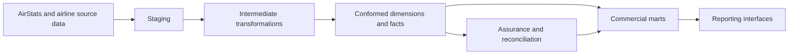

# Airline Operations & Commercial Analytics Engineering Platform

A Snowflake and dbt analytics engineering platform for airline operations, commercial analytics,
billing assurance, fulfilment-driven revenue recognition, and financial reconciliation.

The project models an end-to-end airline data estate: airport reference data, routes, schedules,
operated flights, bookings, passengers, tickets, pricing, invoices, payments, refunds,
adjustments, recognised revenue, balances, exceptions, reconciliation controls, and reporting
marts.

## Overview

This repository implements a specialist airline analytics platform using dbt, SQL, Snowflake
patterns, deterministic source data, dimensional modelling, and governed financial metrics. It is
centred on a practical analytical question: how should operational airline activity flow into
commercial, billing, revenue-recognition, and assurance outputs without losing grain, lineage, or
financial meaning?

AirStats / OurAirports airport reference data provides the conformed airport foundation. Synthetic
airline transactional data then flows through a layered dbt architecture into governed core facts,
commercial marts, reconciliation controls, and analytical reports.

## Business Problem

Airline commercial reporting depends on data that usually spans many systems: airport reference
data, route planning, schedules, flown services, bookings, ticketing, pricing, ancillary sales,
invoicing, payment collection, refunds, adjustments, service fulfilment, and month-end assurance.

Those systems answer different questions. A booking is not a ticket, an invoice is not cash, cash
is not recognised revenue, and a billing anomaly is not necessarily an ETL reconciliation failure.
This platform keeps those states separate while making them traceable through conformed dimensions,
explicit model grains, and source-to-warehouse controls.

## Platform Architecture



The dbt project is organised into `staging`, `intermediate`, `core`, and `marts` layers, with
separate exposures describing the reporting interfaces that consume the marts. Detailed architecture
notes are in [`docs/architecture/overview.md`](docs/architecture/overview.md).

## Airline Data Flow

```text
AirStats / OurAirports
  -> routes
  -> scheduled flights
  -> operated flights
  -> bookings
  -> passengers
  -> tickets / segments
  -> fares / taxes / fees / ancillaries
  -> invoices
  -> payments
  -> refunds / adjustments
  -> service fulfilment
  -> recognised revenue
  -> outstanding balances
  -> billing exceptions
  -> reconciliation
  -> commercial reporting
```

The flow above is implemented through dbt `source()` and `ref()` dependencies, with per-domain
lineage documented under [`docs/data_models/`](docs/data_models/).

## AirStats Airport Reference Foundation

AirStats is the authoritative conformed airport-reference layer for this platform. It stages and
tests OurAirports-style airport, runway, country, region, and airport-comment data, then exposes
airport operations marts for capacity, runway capability, geography, operational status, comment
activity, and data quality.

The airline model conforms routes, airline hubs, operational airports, and airport-level reporting
to `dim_airport`, which is built from the AirStats marts. That keeps airport identity and geography
centralised rather than duplicated across the airline transactional model.

## Commercial and Financial Model

The platform keeps commercial and financial states distinct:

| Measure | Meaning |
| --- | --- |
| Invoiced value | Amount billed to a customer or corporate account. |
| Amount collected | Cash received and applied against invoices. |
| Refunds / adjustments | Post-sale financial movements, each with explicit sign handling. |
| Recognised revenue | Revenue earned only when the underlying flight or ancillary service is fulfilled. |
| Outstanding balance | Amount still due, or over-settled if negative. |
| Financial value at risk | Monetary exposure associated with a detected billing exception. |

Currency handling is explicit throughout: monetary aggregations group by transaction currency, and
the project does not sum raw amounts across currencies. Governed metric definitions are documented
in [`docs/business_glossary/metric_definitions.md`](docs/business_glossary/metric_definitions.md).

## Engineering Highlights

- Layered dbt architecture with source-aligned staging models, reusable intermediate logic,
  governed dimensions/facts, and consumption marts.
- Conformed dimensional model anchored on AirStats `dim_airport`, with explicit grains and
  surrogate keys generated once per entity.
- Contracted core models for the highest-value governed dimensions and facts.
- Incremental facts for append-like transaction events, with late-arrival lookback handling.
- SCD Type 2 snapshots for airport reference data and airline reference entities.
- Generic, source-quality, referential-integrity, snapshot/incremental-integrity, and business-rule
  tests across the dbt project.
- Deterministic synthetic source generation with fixed seeds, control totals, and a catalogued set
  of rule-detectable business anomalies.
- Rule-based billing exception detection that avoids hardcoded record IDs.
- Source-to-warehouse reconciliation across booking, invoice, payment, refund, revenue, and
  financial-control domains.
- Offline-safe CI for parsing, linting, validation, and Python regression tests, plus a
  credentials-gated warehouse-assurance lane for configured Snowflake environments.
- dbt exposures and governed metric definitions for reporting and semantic consistency.

The full production-engineering rationale is in
[`docs/engineering/dbt_production_engineering.md`](docs/engineering/dbt_production_engineering.md).

## Analytical Outputs

The repository includes control outputs and analytical reports generated from the checked-in source
data:

- [`outputs/daily_invoice_control_totals.csv`](outputs/daily_invoice_control_totals.csv) and
  [`reports/billing_reconciliation_report.md`](reports/billing_reconciliation_report.md) for invoice
  and booking reconciliation.
- [`outputs/daily_payment_control_totals.csv`](outputs/daily_payment_control_totals.csv) and
  [`reports/payment_assurance_report.md`](reports/payment_assurance_report.md) for payment controls.
- [`outputs/daily_refund_control_totals.csv`](outputs/daily_refund_control_totals.csv) and
  [`reports/refund_assurance_report.md`](reports/refund_assurance_report.md) for refund controls.
- [`outputs/revenue_reconciliation.csv`](outputs/revenue_reconciliation.csv) and
  [`reports/revenue_recognition_report.md`](reports/revenue_recognition_report.md) for the revenue
  recognition bridge.
- [`reports/month_end_revenue_reconciliation.md`](reports/month_end_revenue_reconciliation.md) for
  month-end financial assurance.

The complete documentation and output inventory is indexed in [`docs/README.md`](docs/README.md).

## Repository Structure

```text
models/
  staging/       source-aligned models
  intermediate/  reusable business transformations
  core/          conformed dimensions and facts
  marts/         airline operations, commercial, billing, revenue, and executive marts
  exposures/     reporting interface definitions
snapshots/       SCD Type 2 history
seeds/           version-controlled reconciliation fixtures
tests/           dbt and Python validation
macros/          reusable dbt macros
scripts/         source generation, validation, and reconciliation scripts
docs/            architecture, data models, engineering notes, glossary, runbooks
reports/         analytical reports
outputs/         reconciliation and assurance outputs
```

## Technology Stack

Snowflake, dbt Core, SQL, Python, GitHub Actions, SQLFluff, `pre-commit`, and AirStats /
OurAirports reference data.

## Getting Started

```bash
python3 -m venv .venv
source .venv/bin/activate
python -m pip install --upgrade pip
python -m pip install -r requirements.txt
dbt deps
dbt parse --profiles-dir .
dbt ls --profiles-dir .
python -m pytest tests/python
```

To regenerate and validate the deterministic airline source data:

```bash
python scripts/generate_airline_data.py
python scripts/generate_control_totals.py
python scripts/generate_reconciliation_evidence.py
python scripts/validate_source_data.py
```

Warehouse-backed dbt execution requires a configured Snowflake environment. Use
[`profiles.example.yml`](profiles.example.yml) as the environment-variable based template for local
configuration.

## Known Limitations

- Airline transactional data is deterministic synthetic data, not real passenger or airline data.
- BI interfaces are documented as dbt exposures; no dashboard file is deployed in this repository.
- Route profitability is excluded because the dataset does not contain a defensible route or flight
  cost model.
- dbt source freshness is not configured because the sources do not include trustworthy ingestion
  timestamps.
- Timestamp-based snapshots are not used because the source entities do not include reliable
  `updated_at` fields.
- Pricing and revenue recognition remain at ticket grain where dictated by the source semantics.
- Warehouse-dependent execution requires a configured Snowflake account and credentials.

## Documentation

- [`docs/README.md`](docs/README.md) - Documentation index
- [`docs/architecture/overview.md`](docs/architecture/overview.md) - Architecture overview
- [`docs/data_models/`](docs/data_models/) - Data model documentation
- [`docs/engineering/dbt_production_engineering.md`](docs/engineering/dbt_production_engineering.md) -
  Production dbt engineering
- [`docs/business_glossary/metric_definitions.md`](docs/business_glossary/metric_definitions.md) -
  Metric definitions
- [`docs/runbooks/dbt_production_runbook.md`](docs/runbooks/dbt_production_runbook.md) - dbt runbook
