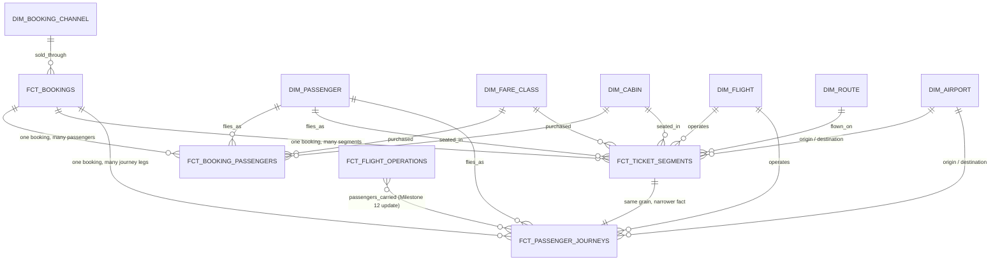

# Airline Booking and Ticketing

## Purpose

Milestone 12 adds the passenger booking and ticketing layer on top of the Milestone 11 conformed
operational layer:

```text
stg_airline__{passengers,bookings,booking_passengers,tickets,ticket_segments,fare_classes}
  -> models/intermediate/booking_lifecycle/int_*.sql (reusable joins/derivations)
  -> models/core/dimensions/dim_{passenger,booking_channel,fare_class,cabin}.sql
  -> models/core/facts/fct_{bookings,booking_passengers,ticket_segments,passenger_journeys}.sql
```

It connects booking -> passenger -> ticket -> ticket segment -> flight instance -> completed/
cancelled passenger journey, reusing the Milestone 11 operational layer
(`int_operated_flight_segments`, `int_scheduled_flight_segments`, `dim_flight`, `dim_route`,
`dim_airport`) rather than rebuilding flight logic.

This milestone does **not** implement fare/pricing calculations, taxes or airport-charge
calculations, products/services pricing logic, invoice calculations, payment allocation,
refunds/adjustments, revenue recognition, billing exceptions, reconciliation, commercial marts,
or dashboards. Those remain planned for Milestone 13 onward (see "Milestone 13 Boundary" below).

## Lifecycle Architecture

```text
booking (current status only, no history)
  -> booking_passenger (one row per passenger on the booking)
    -> passenger
    -> ticket (one per booking_passenger in this dataset)
      -> ticket_segment (one per leg -- one-way: 1, round-trip: 2)
        -> flight_instance (Milestone 11 int_operated_flight_segments)
          -> journey_completion_status (scheduled | completed | cancelled | not_flown | other)
```



## Intermediate Layer: `models/intermediate/booking_lifecycle/`

Five reusable transformation models, in dependency order. A sixth recommended model,
`int_no_show_passengers`, is deliberately **not implemented** -- see "No-Show Passengers" below.

1. **`int_booking_current_state`** -- grain: one row per booking (`booking_id`). The source
   captures only `stg_airline__bookings.status`, a current value, not a status-change history
   table, so this model is named `_current_state` rather than the originally suggested
   `int_booking_status_history` -- no historical booking events are fabricated. Adds
   `passenger_count`/`ticket_count` (structural counts) and `is_cancelled`.
2. **`int_booking_passengers`** -- grain: one row per booking-passenger association
   (`booking_passenger_id`). Joins bookings -> booking_passengers -> passengers, plus each
   passenger's single ticket for the booking and that ticket's fare-class cabin. This is the
   model requested in the Milestone 12 spec as "a reusable model joining bookings ->
   booking_passengers -> passengers"; it was named `int_booking_passengers` rather than the
   originally suggested `int_booking_passenger_segments` because it carries no flight-segment
   data (that is `int_ticketed_segments`) and the original name would have overlapped/confused
   the two.
3. **`int_ticketed_segments`** -- grain: one row per ticketed passenger flight segment
   (`ticket_segment_id`). Joins ticket_segment -> ticket -> the Milestone 11 operational layer
   (`int_operated_flight_segments`) via `flight_instance_id`.
4. **`int_passenger_journey_completion`** -- grain: one row per ticket segment / journey leg.
   Named `int_passenger_journey_completion` rather than the originally suggested
   `int_completed_passenger_journeys` because it classifies *every* segment's completion status,
   not only completed ones. See "Journey-Completion Semantics" below for the full rule.
5. **`int_cancelled_bookings`** -- grain: one row per cancelled booking. Filters
   `int_booking_current_state` to `booking_status = 'cancelled'` and adds
   `affected_ticket_count`/`affected_ticket_segment_count` from `int_ticketed_segments`.

### No-show passengers: deliberately omitted

The Milestone 9 source has no no-show signal anywhere in the schema:
`stg_airline__tickets.ticket_status` is only `issued`/`cancelled`;
`stg_airline__ticket_segments.segment_status` is only `confirmed`/`flown`/`cancelled`; there is no
boarding, check-in, or gate event of any kind. Inferring "no-show" merely because a segment was
not completed would conflate it with an ordinary future-scheduled or cancelled segment, which the
spec explicitly warns against. `int_no_show_passengers` is therefore not implemented.

## Booking/Passenger Relationships

`int_booking_passengers` is the reusable booking -> booking_passenger -> passenger join. Grain is
one row per booking-passenger association. It preserves booking ID, passenger ID, booking status,
booking channel, booking timestamp, corporate account, travel agent, and (via the passenger's
ticket) fare class code and cabin -- no fare values.

## Ticket/Segment Relationships

`int_ticketed_segments` is the reusable ticket -> ticket_segment -> flight-instance join. Grain is
one row per ticketed passenger flight segment. It preserves ticket ID, ticket segment ID,
passenger ID, booking ID, flight instance ID, schedule ID, origin/destination, departure
date/time, ticket status, segment status, cabin, fare class, and the flight instance's
operational completion status (reused from Milestone 11, not recomputed).

## Journey-Completion Semantics

`int_passenger_journey_completion` derives `journey_completion_status` from
`ticket_segments.segment_status` combined with the linked flight instance's
`operational_completion_status` (Milestone 11):

| `segment_status` | flight `operational_completion_status` | `journey_completion_status` |
| --- | --- | --- |
| `cancelled` | any | `cancelled` |
| `flown` | `completed` | `completed` |
| `confirmed` | `scheduled` | `scheduled` |
| `confirmed` | `completed` or `cancelled` | `not_flown` |
| anything else / unrecognised | any | `other` |
| either value `null` | -- | `null` |

`not_flown` represents a segment that still claims to be pending while its flight has already
resolved one way or the other -- a genuine "should have flown but the ticket wasn't updated"
mismatch. In the **current** Milestone 9 dataset this never actually occurs: every `confirmed`
segment pairs with a `scheduled` flight, and every `flown` segment pairs with a `completed`
flight, verified directly against `scripts/airline_synth/build_bookings.py` (segment status is
derived from flight status at generation time) and `scripts/airline_synth/exceptions.py` (the one
post-hoc flight cancellation, EXC-006, also cancels its segments, so it never leaves a `confirmed`
segment behind). `not_flown` is included anyway as a structurally defensible, forward-looking
category -- the same pattern Milestone 11 used for `operational_completion_status`'s `other`
fallback -- not a fabricated one.

### Controlled exception EXC-006 and this layer

`cancelled_flight_without_refund` (see
`docs/data_models/airline_synthetic_exception_catalogue.md`) flips one already-`completed`
`flight_instance` to `cancelled` and cancels its `ticket_segments`, while deliberately leaving the
associated ticket and booking untouched. After this exception, the affected ticket segment(s)
correctly resolve to `journey_completion_status = 'cancelled'` here, even though the parent
ticket's `ticket_status` stays `issued` and the parent booking's `booking_status` stays
`confirmed`. That mismatch is the exception working as designed -- an operational cancellation
without a commercial-level cancellation -- not a defect in this layer, and the affected booking
correctly does **not** appear in `int_cancelled_bookings` (its `booking_status` was never
changed). No other Milestone 9 controlled exception directly affects the booking/ticketing
tables; the rest (invoices, payments, refunds, adjustments, ancillary services) are billing/pricing
concerns out of this milestone's scope, preserved unchanged and untouched.

## Passenger-Carried Counting Rule

`fct_flight_operations.passengers_carried` (previously always `null`, per Milestone 11) is now
populated: for each flight instance, count the ticket segments whose
`journey_completion_status = 'completed'` in `int_passenger_journey_completion`. Because that
model's grain is one row per ticket segment, and each segment names exactly one
`flight_instance_id`, this count is a distinct passenger-segment count with no fan-out risk. A
round trip's outbound and return legs are two separate `ticket_segment_id` rows against two
separate `flight_instance_id` values, so a round-trip passenger is correctly counted once per
flight instance, never twice on the same flight. Cancelled and not-yet-flown segments are
excluded ("do not count cancelled/non-flown passengers as carried"). Flight instances with zero
completed segments (still-scheduled or cancelled flights) get `passengers_carried = 0`, not
`null`, because zero is a real, known count.

`tests/business_rules/airline_ticket_segment_flight_instance_distinct.sql` guards the
no-double-counting assumption directly: it fails if any `(ticket_id, flight_instance_id)` pair
appears on more than one ticket segment, which would otherwise double-count that passenger on
that flight instance.

## Load-Factor Update

`load_factor = passengers_carried / seats_available`, computed only where `seats_available > 0`
(unchanged guard from Milestone 11). `seats_available` remains the actual operating aircraft
type's typical seat count. Given the deliberately small Milestone 9 dataset (~150 passengers,
180 bookings, 864 flight instances), no flight in this dataset approaches its seat capacity, so
`passengers_carried <= seats_available` holds for every row and is tested unconditionally
(`dbt_utils.expression_is_true`, guarded only by `seats_available is not null`).

## Dimensions

| Model | Grain | Natural key | Surrogate key |
| --- | --- | --- | --- |
| `dim_passenger` | synthetic passenger | `passenger_id` | `passenger_key` |
| `dim_booking_channel` | booking channel | `booking_channel` | `booking_channel_key` |
| `dim_fare_class` | fare class | `fare_class_code` | `fare_class_key` |
| `dim_cabin` | cabin category | `cabin` | `cabin_key` |

`dim_booking_channel` and `dim_cabin` have no standalone Milestone 9 source table; both are
derived from `distinct` values already staged elsewhere (`stg_airline__bookings.booking_channel`,
`stg_airline__fare_classes.cabin`), per the Milestone 12 specification. `dim_fare_class`
deliberately excludes `stg_airline__fare_classes`' monetary columns (`base_fare_usd`,
`per_km_usd`, `change_fee_usd`) -- those belong to Milestone 13. `dim_cabin` does not add a
human-readable cabin name (e.g. "Economy"): that mapping (`CABIN_NAMES` in
`scripts/airline_synth/reference.py`) exists only inside the Milestone 9 generator's internal
Python reference data, never in any staged column, so reproducing it here would invent a field
with no source-data authority. `dim_passenger` documents in its model/column descriptions that
every attribute is synthetic and that a future recruiter-facing mart should not expose
name/email/date_of_birth directly, even though this core dimension retains them for source
lineage.

There is no `dim_booking` dimension: a booking is transactional/event-like (see
`fct_bookings`, `int_booking_current_state`'s current-state limitation), not a slowly-changing
reference entity, so it is modelled purely as a fact with its own natural/surrogate key, not
duplicated as a dimension. No `dim_corporate_account` or `dim_travel_agent` exists yet either --
`fct_bookings.corporate_account_id`/`travel_agent_id` are retained as plain lineage attributes,
not FK-tested dimension references, since those dimensions are not in this milestone's scope.

## Facts

| Model | Grain | Natural key | Surrogate key |
| --- | --- | --- | --- |
| `fct_bookings` | booking | `booking_id` | `booking_key` |
| `fct_booking_passengers` | booking-passenger association | `booking_passenger_id` | `booking_passenger_key` |
| `fct_ticket_segments` | ticketed passenger flight segment | `ticket_segment_id` | `ticket_segment_key` |
| `fct_passenger_journeys` | passenger flight segment / journey leg | `ticket_segment_id` | `passenger_journey_key` |

### Single-generation-point surrogate keys

Per `docs/architecture/development_standards.md` and the Milestone 11 precedent (`dim_route`/
`dim_flight` join upstream dimensions for their keys rather than recomputing them), every
surrogate key in this milestone is generated exactly once, in its owning model, and reused
everywhere else via a join:

- `passenger_key`, `fare_class_key`, `cabin_key`, `booking_channel_key` are generated once in
  their respective `dim_*` models.
- `booking_key` is generated once in `fct_bookings` (there is no `dim_booking`; `fct_bookings` is
  the single source of truth for this key). `fct_booking_passengers`, `fct_ticket_segments`, and
  `fct_passenger_journeys` all join `fct_bookings` to obtain it rather than recomputing
  `generate_surrogate_key(['booking_id'])` independently. This is a deliberate, narrow deviation
  from strict dimensional-modelling fact-should-not-join-fact purism, justified by the "do not
  introduce a competing key-generation strategy" requirement and the absence of a booking
  dimension.
- `flight_key`, `route_key`, `origin_airport_key`/`destination_airport_key` are the Milestone 11
  keys, reused unchanged via joins to `dim_flight`, `dim_route`, and `dim_airport`.

### Why both `fct_ticket_segments` and `fct_passenger_journeys`

Both share the same grain (`ticket_segment_id`), which is intentional, not redundant.
`fct_ticket_segments` is the fuller descriptive/operational fact (ticket number, fare class,
cabin, flight timing, statuses) for general reporting. `fct_passenger_journeys` is deliberately
narrower, carrying only the keys and fields needed to answer completion questions
(`journey_completion_status`, `is_completed`, `is_cancelled`), matching the Milestone 12
specification's explicit request for both.

### Why journeys are not collapsed across legs

`fct_passenger_journeys` grain is one row per ticket segment / journey leg, not one row per
ticket or per round trip. The Milestone 9 source has no shared "journey"/"itinerary" key spanning
a ticket's segments beyond `ticket_id` + `segment_sequence`, and grouping by `ticket_id` would
conflate two operationally distinct flight legs -- different `flight_instance_id`, potentially
different `journey_completion_status` -- into a single row, which the Milestone 12 specification
explicitly warns against ("do not collapse multi-leg journeys incorrectly").

## Booking and Ticket Status Semantics

All statuses are taken directly from staged source values (verified against the generated
`data/synthetic/bookings/*.csv` and `scripts/airline_synth/build_bookings.py`); nothing is
invented and no status history is fabricated:

| Field | Values |
| --- | --- |
| `booking_status` | `confirmed`, `cancelled` |
| `ticket_status` | `issued`, `cancelled` |
| `segment_status` | `confirmed`, `flown`, `cancelled` |
| `journey_completion_status` (derived) | `scheduled`, `completed`, `cancelled`, `not_flown`, `other` |

## Known Simplifications

- No booking-status history: only a current status is modelled (`int_booking_current_state`,
  `int_cancelled_bookings`); there is no `cancellation_date`, since the source does not carry
  one.
- No no-show model: the source has no no-show signal (see above).
- `fct_ticket_segments`/`fct_passenger_journeys` do not collapse multi-leg journeys into a single
  itinerary row, since the source has no itinerary key.
- `passengers_carried`/`load_factor` reflect completed passenger *segments*, not confirmed
  check-in or boarding (the source has neither concept).
- Every ticket in a booking shares the same fare class (a Milestone 9 generator simplification,
  documented in `docs/data_models/airline_synthetic_source_data.md`), so `dim_fare_class`/
  `dim_cabin` resolve cleanly with no fan-out risk anywhere in this layer.

## Milestone 13 Boundary

Milestone 13 (Products, Services, Prices and Tariffs) is the next planned milestone. It is
expected to build on `stg_airline__{products,services,ancillary_services,fare_rules,
airport_fees,taxes,discounts}` and finally introduce the fare/pricing calculations this milestone
deliberately excluded from `dim_fare_class` (`base_fare_usd`, `per_km_usd`, `change_fee_usd`) and
from every booking/ticket/segment fact here. Invoice calculations, payment allocation, refunds/
adjustments, revenue recognition, billing exceptions, reconciliation, commercial marts, and
dashboards remain out of scope until their own later milestones, per the existing roadmap.
