# Airline Commercial Reporting Marts

## Purpose

Milestone 20 builds consumption-ready commercial reporting marts on top of the complete, reconciled
core layer established through Milestone 19 -- entirely by reusing existing governed facts and
dimensions:

```text
models/core/dimensions/* + models/core/facts/*
  -> models/marts/airline_operations/*    (flight/route/airport operational reporting)
  -> models/marts/passenger_commercial/*  (booking/journey/channel/fare/cabin/corporate reporting)
  -> models/marts/billing_assurance/*     (invoice/payment/refund/exception/reconciliation reporting)
  -> models/marts/revenue/*               (recognised-revenue reporting)
  -> models/marts/executive/*             (narrow cross-domain summaries)
```

No operational, pricing, billing, exception-detection, revenue-recognition, or reconciliation logic
is recomputed anywhere in this milestone. Every mart is a reporting-layer aggregation or thin
re-selection of an existing core fact/dimension (or, for the executive domain, of another mart).
This milestone does **not** implement dashboards, Power BI files, live BI deployment, production
dbt contracts, incremental models, state-based CI, or semantic-layer/exposure enhancements. Those
remain planned for Milestone 21+ (see "Milestone 21 Boundary" below).

## Architecture

```mermaid
flowchart TB
    subgraph CORE[Core Layer -- Milestones 11-19]
        FCTOPS[fct_flight_operations]
        FCTBOOK[fct_bookings]
        FCTSEG[fct_ticket_segments]
        FCTJRN[fct_passenger_journeys]
        FCTINV[fct_invoices]
        FCTPAY[fct_payments / fct_payment_attempts]
        FCTREF[fct_refunds]
        FCTBAL[fct_outstanding_balances]
        FCTEXC[fct_billing_exceptions]
        FCTREC[fct_reconciliation_controls]
        FCTREV[fct_revenue]
        INTCORP[int_corporate_outstanding_balances]
        INTANC[int_ancillary_revenue_recognition]
        INTTKT[int_ticket_revenue_recognition]
        DIMFLIGHT[dim_flight / dim_route / dim_airport / dim_airline]
        DIMCOMM[dim_fare_class / dim_cabin / dim_booking_channel]
    end

    subgraph OPS[airline_operations marts]
        M1[mart_daily_flight_operations]
        M2[mart_route_operational_performance]
        M3[mart_airline_on_time_performance]
        M4[mart_airport_flight_activity]
    end

    subgraph COMM[passenger_commercial marts]
        M5[mart_booking_performance]
        M6[mart_passenger_journey_performance]
        M7[mart_booking_channel_performance]
        M8[mart_fare_class_performance]
        M9M[mart_cabin_performance]
        M10[mart_corporate_account_activity]
    end

    subgraph BILL[billing_assurance marts]
        M11[mart_daily_billing]
        M12[mart_invoice_status]
        M13[mart_failed_payments]
        M14[mart_unallocated_payments]
        M15[mart_refund_performance]
        M16[mart_outstanding_balances]
        M17[mart_billing_exceptions]
        M18[mart_billing_reconciliation]
    end

    subgraph REV[revenue marts]
        M19[mart_daily_passenger_revenue]
        M20R[mart_revenue_by_route]
        M21[mart_revenue_by_airport]
        M22[mart_route_commercial_performance]
        M23[mart_revenue_by_fare_class]
        M24[mart_revenue_by_cabin]
        M25[mart_ancillary_revenue]
        M26[mart_revenue_by_booking_channel]
        M27[mart_revenue_by_corporate_account]
    end

    subgraph EXEC[executive marts]
        M28[mart_executive_airline_summary]
        M29[mart_executive_revenue_summary]
        M30[mart_executive_billing_assurance]
        M31[mart_executive_route_performance]
    end

    FCTOPS --> M1
    FCTOPS --> M2
    FCTOPS --> M3
    FCTOPS --> M4
    DIMFLIGHT --> M2
    DIMFLIGHT --> M3
    DIMFLIGHT --> M4

    FCTBOOK --> M5
    FCTJRN --> M6
    FCTBOOK --> M7
    FCTSEG --> M8
    FCTSEG --> M9M
    INTCORP --> M10
    FCTBOOK --> M10

    FCTINV --> M11
    FCTINV --> M12
    FCTPAY --> M13
    FCTPAY --> M14
    FCTREF --> M15
    FCTBAL --> M16
    FCTEXC --> M17
    FCTBOOK --> M17
    FCTREC --> M18

    FCTREV --> M19
    FCTREV --> M20R
    INTTKT --> M20R
    FCTOPS --> M20R
    DIMFLIGHT --> M20R
    FCTREV --> M21
    INTTKT --> M21
    M20R --> M22
    FCTREV --> M23
    FCTSEG --> M23
    FCTREV --> M24
    FCTSEG --> M24
    INTANC --> M25
    FCTREV --> M26
    FCTBOOK --> M26
    FCTREV --> M27
    FCTBOOK --> M27

    M1 --> M28
    M19 --> M29
    M16 --> M30
    M17 --> M30
    M22 --> M31
```



## Mart Domains and Grains

| Domain | Mart | Grain |
| --- | --- | --- |
| airline_operations | `mart_daily_flight_operations` | `flight_date` |
| airline_operations | `mart_route_operational_performance` | `route_key` |
| airline_operations | `mart_airline_on_time_performance` | `airline_key` |
| airline_operations | `mart_airport_flight_activity` | `(airport_key, attribution)` |
| passenger_commercial | `mart_booking_performance` | `(booking_status, trip_type)` |
| passenger_commercial | `mart_passenger_journey_performance` | `journey_completion_status` |
| passenger_commercial | `mart_booking_channel_performance` | `booking_channel_key` |
| passenger_commercial | `mart_fare_class_performance` | `fare_class_key` |
| passenger_commercial | `mart_cabin_performance` | `cabin_key` |
| passenger_commercial | `mart_corporate_account_activity` | `(corporate_account_id, currency)` |
| billing_assurance | `mart_daily_billing` | `(invoice_date, currency)` |
| billing_assurance | `mart_invoice_status` | `(status, currency)` |
| billing_assurance | `mart_failed_payments` | `(classified_failure_reason, currency)` |
| billing_assurance | `mart_unallocated_payments` | `(allocation_status, currency)` |
| billing_assurance | `mart_refund_performance` | `(reason, currency)` |
| billing_assurance | `mart_outstanding_balances` | `(settlement_status, currency)` |
| billing_assurance | `mart_billing_exceptions` | `(exception_type, severity, status, currency, route_id, corporate_account_id)` |
| billing_assurance | `mart_billing_reconciliation` | `(control_id, as_of_date)` |
| revenue | `mart_daily_passenger_revenue` | `(event_date, currency)` |
| revenue | `mart_revenue_by_route` | `(route_id, currency)` |
| revenue | `mart_revenue_by_airport` | `(airport_key, attribution, currency)` |
| revenue | `mart_route_commercial_performance` | `(route_id, currency)` |
| revenue | `mart_revenue_by_fare_class` | `(fare_class_key, currency)` |
| revenue | `mart_revenue_by_cabin` | `(cabin_key, currency)` |
| revenue | `mart_ancillary_revenue` | `(service_code, currency)` |
| revenue | `mart_revenue_by_booking_channel` | `(booking_channel_key, currency)` |
| revenue | `mart_revenue_by_corporate_account` | `(corporate_account_id, currency)` |
| executive | `mart_executive_airline_summary` | single row (company-wide) |
| executive | `mart_executive_revenue_summary` | `currency` |
| executive | `mart_executive_billing_assurance` | `currency` |
| executive | `mart_executive_route_performance` | `(route_id, currency)` |

No mart mixes daily, route, and company-wide values in the same row -- each mart's grain is a
single, unambiguous combination of dimensions, documented in its own YAML `description`.

## KPI Naming

KPI names are deliberately precise and never blurred into a generic "revenue":

| Term | Meaning | Source |
| --- | --- | --- |
| `recognised_ticket_revenue` / `recognised_ancillary_revenue` / `total_recognised_revenue` / `net_recognised_revenue` | Earned revenue per Milestone 17's recognition rules | `fct_revenue.gross_recognised_amount` / `net_recognised_amount` |
| `invoice_total_value` | Billed (invoiced) amount, not earned revenue | `fct_invoices.source_invoice_total` / `fct_outstanding_balances.source_invoice_total` |
| `amount_collected_total` | Cash actually collected against invoices, provisional | `fct_invoices.amount_collected` |
| `outstanding_balance_total` | Amount still due (or over-settled if negative) | `fct_outstanding_balances.outstanding_balance` |
| `financial_value_at_risk_total` | Exception-driven monetary exposure, not revenue or a balance | `fct_billing_exceptions.financial_value_at_risk_amount` |

An invoice being issued, cash being collected, and revenue being recognised are three distinct
events with three distinct KPIs -- no mart conflates them, consistent with
`docs/data_models/airline_revenue_recognition.md`.

## Revenue Semantics

`fct_revenue` (Milestone 17) is the sole authoritative source of recognised revenue across every
revenue mart. Invoice totals (`fct_invoices.source_invoice_total`) are never substituted for
recognised revenue: an invoice can be issued before a service is fulfilled, and revenue is only
recognised once fulfilment is confirmed (ticket flown / ancillary fulfilled), independent of
billing or cash collection timing.

Every ticket sale and ancillary sale produces a `fct_revenue` row regardless of whether it was
actually recognised (`gross_recognised_amount` may be `0`) -- so a mart's `recognised_*` measure
reflects only genuinely earned revenue, not a sales count.

## Currency Handling

Currency safety is treated as a hard architectural rule throughout this milestone: **no mart ever
sums raw amounts across different currencies in a single row.** Every mart carrying a monetary
measure groups by `currency` as part of its own grain (see the grain table above); no currency
conversion or normalisation is invented, because no USD-normalized "reporting currency" amount
exists anywhere in the core layer for tickets/ancillaries/invoices/payments/refunds/adjustments
(only `fct_pricing_events.amount_usd` exists, at the charge-component grain, out of scope for these
marts). Every currency-bearing KPI in this milestone is therefore a `transaction_currency_amount`,
reported one row per currency -- there is no `reporting_currency_amount` anywhere in this
milestone's marts. Executive marts (`mart_executive_revenue_summary`, `mart_executive_billing_
assurance`) follow the same rule: they aggregate across dates/routes/exception-slices but still
keep one row per currency, never a single blended total.

## Route Revenue Attribution

`fct_revenue` carries `route_id` only for `ticket_revenue` events, populated via the booking's
outbound route (Milestone 13's own convention -- no single flight exists for a round-trip ticket).
`ancillary_revenue` events have no `route_id` at all (an ancillary purchase is not tied to a
specific flight). Every route-attributing revenue mart (`mart_revenue_by_route`, `mart_revenue_by_
airport`) therefore joins each `ancillary_revenue` row to `int_ticket_revenue_recognition.route_id`
via its `ticket_id`, attributing the ancillary sale to the same route used for that ticket's own
fare recognition. This is a reuse of an already-established value, never a re-derivation of routing
logic.

`route_id`/`fare_class_code`/`cabin` are **not** interchangeable lookup paths from
`fct_ticket_segments`: `fare_class_code` and `cabin` are safely `distinct`-able per `ticket_id`
(every ticket's segments share one fare class and one cabin, Milestone 12's own invariant), but
`route_id` is **not** -- a round-trip ticket's outbound and return segments carry two different
`route_id` values. Every fare-class/cabin revenue mart therefore uses the safe `fct_ticket_segments`
lookup; every route revenue mart uses `int_ticket_revenue_recognition.route_id` instead.

## Route/Airport Attribution Semantics

`mart_airport_flight_activity` and `mart_revenue_by_airport` both report airport-level activity as
two separate rows per airport -- `attribution = 'origin'` and `attribution = 'destination'` --
rather than one summed row. A single flight instance (and the ticket revenue attached to it) has
exactly one origin and one destination; summing both into one "airport total" would double-count
that same activity as if two independent events occurred. Consumers who want a single airport total
must explicitly choose which attribution (or sum both, understanding the double-count) rather than
have this milestone silently pick one for them.

## Passenger/Commercial Metrics

The `passenger_commercial` domain reports structural counts and rates only -- no pricing or revenue
appears here (that is the `revenue` domain's responsibility): booking counts and cancellation rates
by status/trip-type/channel, journey-leg completion shares, fare-class/cabin segment counts and
cancellation rates, and corporate-account booking activity (currency-agnostic counts) alongside
already currency-safe billing measures reused unchanged from `int_corporate_outstanding_balances`
(Milestone 18).

## Billing Assurance

The `billing_assurance` domain is a thin reporting layer over the Milestone 14-19 financial-
assurance facts: no invoice arithmetic, payment allocation, refund-limit calculation, exception
detection, or reconciliation comparison is recomputed anywhere. `mart_billing_exceptions` slices
`fct_billing_exceptions` by `exception_type`, `severity`, `status`, `currency`, and the two
additional dimensions available per this milestone's own instruction (`route_id`,
`corporate_account_id`, both null where an exception type is not route- or booking-scoped).
`mart_billing_reconciliation` is a direct passthrough of `fct_reconciliation_controls` at its own
grain -- no reconciliation math is duplicated.

## Route Commercial Performance and the Profitability Exclusion

`mart_route_commercial_performance` is the explicit, documented substitute for a "route
profitability" mart. This repository contains **no route or flight cost data** -- no fuel, crew,
maintenance, or airport-charge cost basis exists anywhere in the Milestone 9 synthetic-data
specification -- so profitability (revenue minus cost) cannot be defensibly computed, and this
milestone does not fabricate one. Instead, `mart_route_commercial_performance` selects directly
from `mart_revenue_by_route` (avoiding duplicating that model's route/revenue/operations join) and
exposes only revenue-per-unit commercial metrics:

- `revenue_per_passenger` = `total_recognised_revenue / total_passengers_carried`
- `revenue_per_flight` = `total_recognised_revenue / flight_count`
- `average_ticket_value` (on the fare-class/cabin marts) = `total_recognised_revenue / ticket_count`
- `ancillary_revenue_per_passenger` is not separately exposed as a named KPI beyond what
  `recognised_ancillary_revenue` already reports per route/fare-class/cabin/currency, since a
  passenger-level ancillary attribution rate is not independently meaningful without a cost basis.

Explicitly **not** computed anywhere in this milestone, because they require data this repository
does not have: RASK (revenue per available seat-kilometre -- no seat-km cost basis), CASK (cost per
available seat-kilometre -- no cost data at all), profit margin, or contribution margin. `load_
factor` (`passengers_carried / seats_available`) is reused from the operational layer, not
recomputed, and is a capacity-utilisation measure, not a profitability measure.

## Executive Marts

The four executive marts are deliberately narrow consumption contracts, not denormalized dumps of
every mart's columns:

- `mart_executive_airline_summary`: single company-wide row, reused from `mart_daily_flight_
  operations`; no currency measure appears, so no cross-currency risk exists.
- `mart_executive_revenue_summary`: one row per currency, reused from `mart_daily_passenger_
  revenue`; never collapses across currency.
- `mart_executive_billing_assurance`: one row per currency, reused from `mart_outstanding_balances`
  and `mart_billing_exceptions`; never collapses across currency.
- `mart_executive_route_performance`: one row per `(route_id, currency)`, reused from `mart_route_
  commercial_performance`; carries the same profitability exclusion as its source mart.

Each executive mart selects from an already-aggregated mart rather than re-aggregating a core fact,
so no aggregation logic is duplicated between the domain-level marts and their executive summaries.

## Testing Strategy

Mart tests protect the **consumption contract**, not the upstream business logic already tested at
the core layer: declared-grain uniqueness (`dbt_utils.unique_combination_of_columns`), non-null
grouping/dimension keys, `relationships` tests back to `dim_*`/`fct_*` where a surrogate key is
carried, non-negative counts and amounts (`dbt_expectations.expect_column_values_to_be_between`),
rate/load-factor bounds of `[0, 1]`, revenue-arithmetic consistency
(`dbt_utils.expression_is_true`, e.g. `total_recognised_revenue = recognised_ticket_revenue +
recognised_ancillary_revenue`), route origin/destination consistency (`origin_ident !=
destination_ident`), and executive-summary arithmetic where enforceable (`mart_executive_revenue_
summary.net_recognised_revenue` reconciles to its own components). No upstream fact-level test
(pricing correctness, exception detection, reconciliation comparison) is re-implemented here.

## Offline Execution Limitation

No Snowflake connection is used anywhere in this milestone. Validation is limited to `dbt parse`,
`dbt ls`, SQLFluff (`--templater jinja`), pre-commit's non-dbt-templated hooks, `git diff --check`,
a grep-based secret scan, and the existing Python regression suites (Milestone 9 synthetic-data
validation, Milestone 19 reconciliation-evidence regeneration). No mart has been executed against a
live warehouse; row counts, exact numeric outputs, and query performance remain unverified until a
real `dbt run`/`dbt test` against Snowflake.

## Milestone 21 Boundary

Milestone 21 (Production dbt Engineering) is the next planned milestone. It is expected to address
production dbt contracts, incremental model design, state-based CI (`dbt build --select
state:modified+`), exposures/semantic-layer definitions, and any further macro/snapshot hardening --
all explicitly out of scope here. Dashboard implementation, live BI deployment, and final portfolio
README polish remain reserved for Milestone 22 or later, per the existing roadmap. This milestone
does not implement any of that work.
