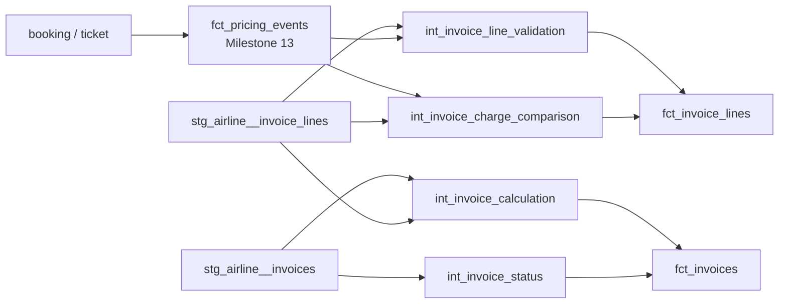

# Airline Invoices and Invoice Lines

## Purpose

Milestone 14 adds a trustworthy invoice layer on top of the Milestone 10 invoice staging tables
and the Milestone 13 pricing layer:

```text
stg_airline__{invoices,invoice_lines}
  + fct_pricing_events, int_booking_charge_components (Milestone 13, read-only reuse)
  -> models/intermediate/billing/int_*.sql (reusable calculations)
  -> models/core/facts/fct_{invoices,invoice_lines}.sql
```

It connects booking/ticket -> expected pricing components -> invoice -> invoice lines -> invoice
arithmetic controls, reusing `fct_pricing_events` and `stg_airline__{invoices,invoice_lines}`
rather than recomputing pricing or reinventing invoice fields.

This milestone does **not** implement payment allocation, failed-payment classification, refunds,
adjustments, credit-note application, vouchers, revenue recognition, outstanding balances,
billing-exception classification, reconciliation, commercial marts, or dashboards. Those remain
planned for Milestone 15 onward (see "Milestone 15 Boundary" below). This milestone establishes
invoice **structure and validation** -- it stops at exposing comparison evidence, never at
classifying it.

## Invoice Architecture



## Grains and Keys

| Model | Grain | Key |
| --- | --- | --- |
| `int_invoice_status` | invoice | `invoice_id` |
| `int_invoice_calculation` | invoice | `invoice_id` |
| `int_invoice_charge_comparison` | (invoice, comparable_line_type, reference_code, ticket_id) | see below |
| `int_invoice_line_validation` | invoice line | `invoice_line_id` |
| `fct_invoices` | invoice | `invoice_id` / `invoice_key` |
| `fct_invoice_lines` | invoice line | `invoice_line_id` / `invoice_line_key` |

`int_invoice_charge_comparison`'s natural key is the tuple `(invoice_id, comparable_line_type,
reference_code, ticket_id)` -- `ticket_id` is null only for the booking-scoped `discount` type.
This is not a single-column key because the model's purpose is to align two independently
generated tables (Milestone 9's `invoice_lines` and Milestone 13's `fct_pricing_events`) that share
no common ID; the tuple is what makes that alignment deterministic (see "Pricing-to-Invoice
Relationship" below).

## Pricing-to-Invoice Relationship

`fct_pricing_events` (Milestone 13) and `stg_airline__invoice_lines` (Milestone 9) are two
**independently generated** representations of the same underlying charges -- Milestone 13 is this
repository's own deterministic recomputation from `fare_classes`/`fare_rules`/`taxes`/
`airport_fees`/`discounts`/`services`; Milestone 9's `invoice_lines` is the generator's own
billing output (`scripts/airline_synth/build_billing.py`). They are joined, never merged or
recomputed against each other, via two verified alignments:

1. **`comparable_line_type` bucketing.** `build_billing.py` generates exactly **one** `base_fare`
   invoice line per ticket, with `amount = base_fare_usd + per_km_usd * distance_km` combined --
   there is no separate `distance_fare` line type anywhere in the Milestone 9 specification.
   Comparing Milestone 13's separate `base_fare` and `distance_fare` components individually
   against that single combined source line would produce a spurious variance on every ticket, not
   a real one. `comparable_line_type` therefore maps `base_fare` + `distance_fare` onto one bucket
   (`base_fare`); every other `component_type` maps to itself unchanged (`tax`, `airport_fee`,
   `ancillary`, `discount`).
2. **`reference_code` alignment.** Verified directly against `build_billing.py`'s invoice-line
   construction, the code used to identify *which* fare class / tax / fee / service / discount a
   line represents is identical on both sides: `fare_class_code` (base fare), `tax_code` (tax),
   `fee_code` (airport fee), `service_code` (ancillary), `discount_code` (discount). Grouping the
   expected side by `reference_code` also achieves the base_fare + distance_fare combination above
   with no special-case logic, since both Milestone 13 rows for a ticket share the same
   `fare_class_code`.

Ticket-scoped components (`base_fare`, `tax`, `airport_fee`, `ancillary`) are matched via
`invoice_id -> booking_id -> ticket_id` (every ticket under an invoice's booking); the
booking-scoped `discount` component is matched via `invoice_id -> booking_id` directly, with
`ticket_id` null on both sides -- consistent with how Milestone 13 itself scopes `discount`.

This alignment intentionally does **not** assume a 1:1 row correspondence via a shared ID (none
exists); it is a `FULL OUTER JOIN` on the tuple above, so a component present on one side but
absent on the other (a missing invoice line, or -- symmetrically -- a pricing component with no
invoice line at all) still produces a row with a null `expected_amount` or `invoiced_amount`
rather than silently disappearing.

## Invoice Arithmetic

Two independent, complementary arithmetic controls exist:

1. **Internal invoice reconciliation** (`int_invoice_calculation`, `fct_invoices`): does an
   invoice's own header total agree with the sum of its own lines?

   ```text
   calculated_invoice_line_total = sum(invoice_lines.amount) for that invoice_id
                                    (using the actual invoice-line sign convention --
                                    discount lines are already negative)

   invoice_total_variance = source_invoice_total - calculated_invoice_line_total
   ```

   `source_invoice_total` (`invoices.total_amount`) is **never overwritten**; both it and
   `calculated_invoice_line_total` are kept side by side so later assurance can compare them
   directly, per this milestone's explicit requirement.

2. **External pricing-vs-invoice comparison** (`int_invoice_charge_comparison`,
   `fct_invoice_lines.pricing_variance_amount`): does an invoice's line agree with what Milestone
   13's independent pricing calculation expects?

   ```text
   variance_amount = invoiced_amount - expected_amount
   ```

   (nulls treated as 0 for this subtraction only; the raw `expected_amount`/`invoiced_amount`
   columns stay nullable so a reader can distinguish "charged zero" from "no line/component exists
   at all").

**Sign convention (both controls)**: variance = *source/invoiced amount minus calculated/expected
amount*. Positive means the source records more than expected/calculated; negative means less,
including a component missing entirely. This convention is consistent across
`int_invoice_calculation.invoice_total_variance` and
`int_invoice_charge_comparison.variance_amount` / `fct_invoice_lines.pricing_variance_amount`.

`invoices.discount_amount` is documented in staging as "a positive magnitude," while
`calculated_discount_total` (summed directly from `invoice_lines.amount` where `line_type =
'discount'`) is negative or zero, matching the actual line sign convention this milestone is
required to preserve. The relationship is `source_discount_amount = -calculated_discount_total` in
the clean case; no column silently flips this sign to hide the difference.

## Source vs. Calculated Totals

| Column (on `fct_invoices`) | Meaning |
| --- | --- |
| `source_invoice_total` | `invoices.total_amount`, unchanged from source |
| `source_subtotal_amount` / `source_tax_amount` / `source_fee_amount` / `source_ancillary_amount` / `source_discount_amount` | The invoice header's own pre-aggregated fields, unchanged from source |
| `calculated_invoice_line_total` | Independently summed from this invoice's own `invoice_lines.amount` |
| `calculated_base_fare_total` / `calculated_tax_total` / `calculated_fee_total` / `calculated_ancillary_total` / `calculated_discount_total` | The same, broken out by `line_type` |
| `invoice_total_variance` | `source_invoice_total - calculated_invoice_line_total` |

No `source_*` column is ever overwritten by a `calculated_*` value, or vice versa -- both are
always exposed side by side.

## Variance Semantics

A nonzero `invoice_total_variance` or `pricing_variance_amount` is **evidence**, not a verdict.
This milestone deliberately stops short of asking "is this variance a billing exception, and how
severe is it?" -- that classification (`is_incorrect_fare`, `billing_exception_type`,
`financial_value_at_risk`, or similar) is explicitly out of scope until Milestone 18. What this
milestone guarantees is that the evidence needed to answer that question later is present,
correctly signed, and undamaged by any repair logic.

## Controlled Anomaly Preservation

Four Milestone 9 controlled exceptions touch the invoice/invoice-line tables directly (see
`docs/data_models/airline_synthetic_exception_catalogue.md`), and this milestone preserves every
one of them, unrepaired and unclassified:

- **`duplicate_invoice`**: two distinct `invoice_id` values share the same `booking_id`. Both
  invoice rows (and both sets of cloned invoice lines) pass through `int_invoice_calculation`,
  `int_invoice_charge_comparison`, and `fct_invoices`/`fct_invoice_lines` unchanged and
  independently. `booking_id` is deliberately **not** unique-tested on `fct_invoices`. Because the
  pricing-side expected components are joined via `invoice_id -> booking_id -> ticket_id`, both
  duplicate invoices independently receive the same full set of expected-vs-invoiced comparison
  rows against the one real set of pricing components -- exactly the evidence a later
  duplicate-invoice-detection model (Milestone 18) will need, without this milestone building that
  detection itself.
- **`missing_invoice_line`**: one invoice's `tax` line was removed without adjusting its header.
  Observable as a nonzero `invoice_total_variance` on that invoice, and as a null `invoiced_amount`
  (with a non-null `expected_amount`) on the corresponding `tax` row in
  `int_invoice_charge_comparison`. Not repaired; no line is synthesised to "fix" the count.
- **`incorrect_fare`**: one `base_fare` invoice line's `amount` was overwritten to a value
  inconsistent with the fare formula. Because Milestone 13's `fct_pricing_events` is computed
  independently of `invoice_lines` (it never reads billing tables), this surfaces as a nonzero
  `pricing_variance_amount` on exactly that one line in `fct_invoice_lines`, with the source
  `amount` left untouched.
- **`completed_segment_without_recognised_revenue_precursor`**: one flown ticket's `base_fare`
  invoice line was removed entirely. Observable as a null `invoiced_amount` (non-null
  `expected_amount`) in `int_invoice_charge_comparison`, and as that invoice's nonzero
  `invoice_total_variance` -- the fulfilled service has no billed revenue precursor, exactly as
  named, and this milestone does not fabricate one.

`tests/business_rules/airline_invoice_controlled_anomalies_present.sql` guards all four
signatures directly, failing if any of them is ever accidentally filtered out, joined away, or
"corrected" by a future change.

## Currency Handling

Invoice and invoice-line currencies are preserved exactly as staged; no conversion is applied to
`fct_invoices`/`fct_invoice_lines` amounts. `dim_currency` (Milestone 13) is reused for
conformance (`currency_key` on both facts). In the current dataset, `invoice_lines.amount` and the
corresponding `fct_pricing_events.amount` are already denominated in the same currency (the
booking's own currency -- both `build_billing.py` and Milestone 13's pricing layer use it
throughout), so `int_invoice_charge_comparison` compares transaction-currency amounts directly with
no FX conversion, per this milestone's scope boundary ("do not convert invoice totals unnecessarily
if the source and pricing comparison can remain in transaction currency"). The existing
`convert_currency` macro (Milestone 13) is available and would be used consistently if a USD audit
column were ever added here; none was needed for this milestone's controls. No FX gain/loss
accounting is modelled -- that belongs to a much later milestone, if ever.

## Core Facts

### `fct_invoices`

Grain: one row per invoice. Includes `invoice_id`, `booking_key`/`booking_id`, `invoice_date_utc`,
`currency_key`/`currency`, `source_invoice_total` (and its component breakdown),
`calculated_invoice_line_total`, `line_count`, `status`/`is_cancelled`, `bill_to_type`/`bill_to_id`
(the invoice's own corporate/travel-agent/passenger reference), and `invoice_total_variance`. There
is no `ticket_id` on this fact: the source `invoices` table has no ticket-level column (an invoice
bills a whole booking), so ticket references live on `fct_invoice_lines` instead, where the source
actually carries `ticket_id` per line. Excludes `amount_paid`, outstanding balance, refund amount,
and recognised revenue.

### `fct_invoice_lines`

Grain: one row per invoice line. Includes `invoice_line_id`, `invoice_key`/`invoice_id`,
`booking_key`/`booking_id`, `ticket_id` (null for booking-level discount lines), `line_type`,
`reference_code`, `currency_key`/`currency`, `amount` (source, unchanged), `expected_amount` and
`pricing_variance_amount` (from `int_invoice_charge_comparison`), and the four structural
validation signals from `int_invoice_line_validation`. Excludes payment, refund, and revenue
fields.

## Known Simplifications

- No invoice-status history: only a current status is modelled (`int_invoice_status`), matching
  `int_booking_current_state`'s (Milestone 12) precedent -- the source has no status-change
  history table.
- `status` values (`issued`/`paid`/`refunded`/`cancelled`) already partially reflect
  payment/refund outcomes baked into the Milestone 9 generator; this milestone surfaces them
  verbatim and does not derive any new payment-based status.
- The pricing-vs-invoice comparison is bucket/reference-code-level, not a literal row-for-row join
  by a shared ID (none exists between `fct_pricing_events` and `invoice_lines`).
- `bill_to_type`/`bill_to_id` are retained as plain descriptive attributes, not FK-tested dimension
  references, since no `dim_corporate_account`/`dim_travel_agent` exists yet (matching
  `fct_bookings`'s Milestone 12 precedent for the same fields).

## Milestone 15 Boundary

Milestone 15 (Payments and Failed Payments) is the next planned milestone. It is expected to build
on `stg_airline__{payment_attempts,payments}` and finally model payment allocation and
failed-payment classification against the invoice structure this milestone established. Refunds,
adjustments, credit-note application, vouchers, revenue recognition, outstanding balances,
billing-exception classification (including formally classifying the anomalies preserved above),
reconciliation, commercial marts, and dashboards remain out of scope until their own later
milestones, per the existing roadmap.
