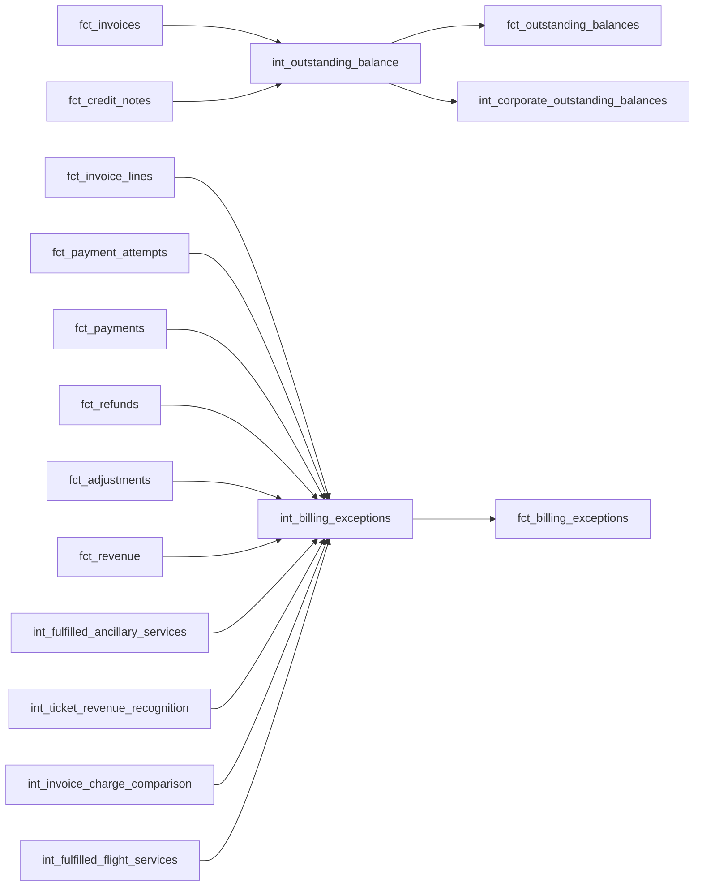

# Airline Outstanding Balances and Billing Exceptions

## Purpose

Milestone 18 builds the first complete financial-assurance layer, entirely on evidence already
created in Milestones 14-17:

```text
fct_invoices + fct_credit_notes
  -> models/intermediate/billing/int_outstanding_balance.sql
  -> models/intermediate/billing/int_corporate_outstanding_balances.sql
  -> models/core/facts/fct_outstanding_balances.sql

fct_invoice_lines + fct_payment_attempts + fct_payments + fct_refunds + fct_adjustments
  + fct_revenue + int_fulfilled_ancillary_services + int_ticket_revenue_recognition
  + int_invoice_charge_comparison + int_fulfilled_flight_services
  -> models/intermediate/billing/int_billing_exceptions.sql
  -> models/core/facts/fct_billing_exceptions.sql
```

No pricing, invoice arithmetic, payment allocation, refund logic, or revenue recognition is
recomputed anywhere in this milestone -- every formula and every detection rule reads a column
some earlier milestone already computed. This milestone does **not** implement source-to-warehouse
reconciliation, month-end reconciliation, commercial marts, route profitability, executive
reporting, or dashboards. Those remain planned for Milestone 19 onward (see "Milestone 19
Boundary" below).

## Architecture



## Final Outstanding-Balance Formula

Grain: **one row per invoice**. All component measures are kept visible, never hidden inside one
opaque expression:

```text
outstanding_balance = source_invoice_total
                       - amount_collected
                       + refund_amount
                       + net_adjustment_amount
```

### Component Sign Conventions (Milestone 15/16 semantics as authority)

| Component | Convention | Why it's added/subtracted here |
| --- | --- | --- |
| `source_invoice_total` | Positive (what was billed) | Starting point |
| `amount_collected` (M15) | Positive (already "applied toward this invoice") | **Subtracted** -- money collected reduces what remains due |
| `refund_amount` (M16) | Always positive ("money returned to the customer") | **Added back** -- a refund reverses a prior collection, restoring the amount due that collection had settled |
| `net_adjustment_amount` (M16) | Native sign: credit = negative (decreases amount due), debit = positive (increases amount due) | **Added directly**, no sign flip -- it already speaks in "amount due" terms |

`credit_note_amount` is exposed as its own visible column (`fct_outstanding_balances.
credit_note_amount`) but is **deliberately not netted into the formula above**. Milestone 16
established that a credit note in this dataset is a paper-trail document evidencing a refund, not
an independent invoice-application instrument, and in the normal flow `credit_note.amount` is
definitionally identical to its linked `refund.amount` (same code path in
`scripts/airline_synth/build_billing.py`, same value). Netting both `refund_amount` and
`credit_note_amount` would double-count the same cash movement. No credit note in the current
dataset is ever linked to an adjustment instead of a refund (`has_adjustment_link` is always
false), so this limitation is documented but not currently exercised.

## Outstanding-Balance Semantics

- **Positive** `outstanding_balance` = amount still due.
- **Zero** = financially settled under this model.
- **Negative** = over-settled / a customer-credit position. **Never clamped to zero** -- a
  negative balance can be important exception evidence (e.g. a refund or credit that exceeded what
  was ever actually collected).

`settlement_status` is derived neutrally from the sign alone: `outstanding` (> 0), `settled`
(= 0), `over_settled` (< 0). No collections-workflow language or urgency is implied by this field.

## Corporate Outstanding Balances

`int_corporate_outstanding_balances` is grain **one row per corporate account per currency** --
not strictly one row per account. Verified against `scripts/airline_synth/build_billing.py`, an
invoice's `bill_to_id` is set to the booking's own `corporate_account_id` whenever `bill_to_type =
'corporate'` -- the same identifier `stg_airline__corporate_accounts.corporate_account_id` uses,
so the linkage is direct and reliable, justifying this model's existence. It deliberately does
**not** sum across different currencies into one number (which would silently fabricate a
meaningless mixed-currency total, since a corporate account's invoices can span more than one
point-of-sale currency); no currency conversion is invented to force a single row, per this
milestone's currency scope. This is a current-state aggregate only, not a commercial customer
mart.

## Billing-Exception Taxonomy and Detection Rules

Grain: **one row per detected exception**, keyed by `(exception_type, source_record_id)`. Every
one of the fourteen exception types below reuses an existing evidence column directly; none
recomputes anything. `source_system` mirrors the exact "Affected entity" values already used in
`docs/data_models/airline_synthetic_exception_catalogue.md`.

| `exception_type` | Reused evidence | Detection rule |
| --- | --- | --- |
| `duplicate_invoice` | `fct_invoices.booking_id` (deliberately not unique-tested) | `count(*) > 1` invoices sharing one `booking_id` |
| `failed_payment_after_ticket_issue` | `fct_invoices.payment_count`, `fct_payment_attempts.attempt_classification` | Issued invoice, `total_amount > 0`, zero successful payments, >= 1 failed attempt |
| `unallocated_payment` | `fct_payments.unallocated_amount`, `has_invoice_match` | Matched payment with `unallocated_amount > 0` |
| `payment_without_invoice` | `fct_payments.has_invoice_match` | `has_invoice_match = false` |
| `incorrect_fare` | `fct_invoice_lines.pricing_variance_amount` | `base_fare` line with nonzero variance |
| `currency_mismatch` | `fct_payments.is_currency_match` | `is_currency_match = false` (null, not false, when unmatched -- already excludes `payment_without_invoice`) |
| `refund_greater_than_collected_amount` | `fct_refunds.refund_limit_variance` | `refund_limit_variance > 0` |
| `invalid_adjustment` | `fct_adjustments.has_invoice_match`, `has_expected_sign_for_type` | Either condition false (the one deliberately injected row fails both) |
| `cancelled_flight_without_refund` | `int_fulfilled_flight_services.is_cancelled`, `fct_bookings.is_cancelled`, `fct_refunds` | Segment cancelled, booking NOT cancelled, no refund exists for the booking -- see below |
| `completed_segment_without_recognised_revenue_precursor` | `fct_revenue` (`ticket_revenue`, M17), `fct_invoice_lines` | Recognised revenue exists; no matching `base_fare` invoice line |
| `ancillary_sold_but_not_fulfilled` | `int_fulfilled_ancillary_services.fulfilment_indicator`, `int_ticket_revenue_recognition.is_recognition_eligible` | Not-fulfilled ancillary on a ticket whose segments all flew -- see below |
| `ancillary_fulfilled_but_not_billed` | `int_fulfilled_ancillary_services.fulfilment_indicator`, `fct_invoice_lines` | Fulfilled ancillary; no matching `ancillary` invoice line |
| `missing_invoice_line` | `int_invoice_charge_comparison` (`tax` type) | Expected tax amount exists; invoiced amount is null |
| `late_arriving_payment` | `fct_payments.payment_delay_days` | `payment_delay_days > 30` (see below) |

### `cancelled_flight_without_refund`: why this rule is precise, not inferred

Verified against `scripts/airline_synth/exceptions.py`: in the normal generation flow,
`segment_status` only ever becomes `cancelled` when the booking itself was cancelled (a cascading
cancellation) **or** via this exact controlled exception (an operational flight-instance
cancellation applied post-hoc, deliberately leaving the booking/invoice/payment untouched). "A
segment is cancelled but its booking is not, and no refund exists for that booking" is therefore a
precise, non-hardcoded signature for this specific condition -- not an inferred refund entitlement
invented beyond what the exception definition supports.

This exception's grain deviates deliberately from the exception catalogue's own key
(`flight_instance_id`): one row is produced **per affected ticket segment**, not per flight,
because multiple passengers/segments can share one `flight_instance_id`, and tracking each
affected passenger's own financial exposure separately is more useful than one row per flight.
`financial_value_at_risk_amount` reuses the ticket's own `priced_fare_amount`
(`int_ticket_revenue_recognition`, M13/17) -- the fare paid for a segment that will never fly and
was never refunded.

### `ancillary_sold_but_not_fulfilled`: why this rule is precise, not inferred

Verified against `scripts/airline_synth/build_bookings.py::build_ancillary_services`: a
`not_fulfilled` ancillary can only naturally occur when **none** of its ticket's segments ever
flew. A `not_fulfilled` ancillary attached to a ticket that IS recognition-eligible (every segment
flew) is therefore a combination the normal generator can never produce -- a precise, non-hardcoded
signature for this specific controlled exception, reused unchanged from Milestone 17's own test
logic.

### `missing_invoice_line`: why `tax`-only avoids collision with the other two invoice-comparison rules

`incorrect_fare` and `completed_segment_without_recognised_revenue_precursor` both also produce a
nonzero/null-invoiced signal on `int_invoice_charge_comparison`, but only for
`comparable_line_type = 'base_fare'` rows. Restricting `missing_invoice_line` to
`comparable_line_type = 'tax'` precisely isolates a removed tax line (the actual injected
condition) from those two, using the same underlying comparison model at a different bucket, not a
new join.

### `late_arriving_payment`: the 30-day threshold

The Milestone 9 specification defines no fixed "late" threshold anywhere -- the exception
catalogue only states normal turnaround is hours. 30 days is a deliberately conservative,
documented business rule, well below the 75-day value the one deliberately injected exception
actually produces -- a real threshold rule, not a disguised match to that specific record's
magnitude.

## No Hard-Coded IDs

Every branch in `int_billing_exceptions` is a deterministic rule over existing evidence columns.
None references a specific `invoice_id`, `payment_id`, `refund_id`, or any other record identifier
literally -- each would fire identically against any dataset the same generator produces, not just
the one currently checked in. `tests/business_rules/airline_billing_exception_coverage.sql`
verifies coverage the same way: by asserting each of the fourteen `exception_type` values has a
non-zero detected count, never by matching a specific ID.

## Severity Logic

Severity is driven by **exception type** (a documented tier reflecting that type's typical
business/operational significance) **and monetary exposure** (escalated by exactly one tier when
`financial_value_at_risk_amount >= 1000`, capped at `critical`) -- never randomness.

| Tier | Types | Rationale |
| --- | --- | --- |
| `critical` | `duplicate_invoice`, `refund_greater_than_collected_amount`, `invalid_adjustment`, `payment_without_invoice` | Direct cash leakage, double-billing risk, or audit/compliance exposure with an unclear revenue trail |
| `high` | `unallocated_payment`, `incorrect_fare`, `missing_invoice_line`, `cancelled_flight_without_refund` | Revenue-integrity or customer-impacting failures with a bounded, known amount |
| `medium` | `currency_mismatch`, `completed_segment_without_recognised_revenue_precursor`, `failed_payment_after_ticket_issue` | Reconciliation friction or internal-control gaps, not necessarily lost money |
| `low` | `ancillary_sold_but_not_fulfilled`, `ancillary_fulfilled_but_not_billed`, `late_arriving_payment` | Smaller-dollar operational/data-quality issues or pure timing anomalies |

The $1000 escalation threshold is a fixed, documented materiality reference relative to this
dataset's typical single-transaction fare magnitudes (base fare + per-km distance component,
generally well under this figure for most routes) -- large enough to matter, not tuned to any
specific record.

## Financial Value at Risk Convention

`financial_value_at_risk_amount` is always a **non-negative absolute magnitude**, drawn from the
single most relevant existing monetary evidence column per exception type (see the detection-rule
table above and each branch's own comment in `int_billing_exceptions.sql` for the precise source).
The one deliberate exception is `late_arriving_payment`, which is genuinely `0`: the money did
arrive, so a timing anomaly has no monetary exposure by definition -- not an unknown or
unpopulated one.

## Workflow-Field Limitations

No investigation, assignment, or resolution ever occurred in this synthetic dataset, and this
milestone does not fabricate one:

- `status` defaults to the single deterministic value `'open'` for every detected exception -- a
  reasonable current-state default (every exception here was just detected, not yet worked), not
  a claim that any triage process exists.
- `assigned_owner`, `resolution_date`, `root_cause`, and `remediation_action` are always `null`.
  No deterministic synthetic workflow-history data exists anywhere in the Milestone 9
  specification to populate them honestly.
- `rule_description` (on `int_billing_exceptions`, carried through unchanged) is explicitly **not**
  `root_cause`: it is a mechanical statement of which detection rule fired, kept as a clearly
  separate, honestly-named column.

## Controlled Exception Coverage

All fourteen Milestone 9 controlled exceptions relevant to billing/revenue are implemented and
detected:

| Catalogue `exception_type` | Implemented as | Detectable from existing evidence? |
| --- | --- | --- |
| `duplicate_invoice` | `duplicate_invoice` | Yes |
| `failed_payment` | `failed_payment_after_ticket_issue` | Yes |
| `unallocated_payment` | `unallocated_payment` | Yes |
| `incorrect_fare` | `incorrect_fare` | Yes |
| `refund_greater_than_collected_amount` | `refund_greater_than_collected_amount` | Yes |
| `cancelled_flight_without_refund` | `cancelled_flight_without_refund` | Yes |
| `late_arriving_payment` | `late_arriving_payment` | Yes (via a documented 30-day threshold) |
| `missing_invoice_line` | `missing_invoice_line` | Yes |
| `completed_segment_without_recognised_revenue_precursor` | `completed_segment_without_recognised_revenue_precursor` | Yes |
| `payment_without_invoice` | `payment_without_invoice` | Yes |
| `ancillary_sold_but_not_fulfilled` | `ancillary_sold_but_not_fulfilled` | Yes |
| `ancillary_fulfilled_but_not_billed` | `ancillary_fulfilled_but_not_billed` | Yes |
| `currency_mismatch` | `currency_mismatch` | Yes |
| `invalid_adjustment` | `invalid_adjustment` | Yes |

All 14 of the Milestone 9 catalogue's exceptions are billing/revenue-relevant and are detected
here (there is no source anomaly in this milestone's remaining, undetectable category to disclose).

## Limitations

- Detection is purely rule-based against existing evidence; no exception is guaranteed to catch
  every conceivable future anomaly of its type, only the specific deterministic condition
  documented per rule.
- `int_corporate_outstanding_balances` deliberately produces multiple rows for a corporate account
  whose invoices span more than one currency, rather than fabricating a converted total.
- Severity and financial-value-at-risk are both deterministic, documented business rules, not a
  claim of actuarial or legal precision.

## Milestone 19 Boundary

Milestone 19 (Reconciliation Controls) is the next planned milestone. It is expected to build
formal source-to-warehouse and month-end reconciliation controls on top of the complete
outstanding-balance and exception-detection layer this milestone established. Commercial reporting
marts, route profitability, executive reporting, and dashboards remain out of scope until their
own later milestones (20+), per the existing roadmap.
