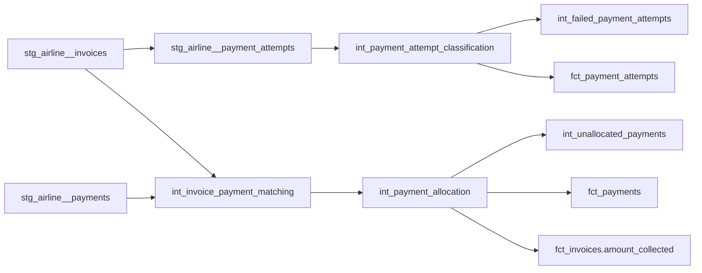

# Airline Payments and Failed Payments

## Purpose

Milestone 15 adds a reliable payment layer on top of the Milestone 10 payment staging tables and
the Milestone 14 invoice layer:

```text
stg_airline__{payment_attempts,payments}
  + fct_invoices, fct_invoice_lines, dim_currency (Milestone 14/13, read-only reuse)
  -> models/intermediate/billing/int_payment_*.sql, int_invoice_payment_matching.sql,
     int_invoice_payment_matching-derived models (reusable calculations)
  -> models/core/dimensions/dim_payment_method.sql
  -> models/core/facts/fct_{payment_attempts,payments}.sql
  -> fct_invoices extended with amount_collected/payment_count
```

It connects invoice -> payment attempt -> successful/failed result -> payment transaction ->
invoice allocation -> collected amount, reusing `fct_invoices`/`fct_invoice_lines`/`dim_currency`
rather than recomputing invoice arithmetic or pricing.

This milestone does **not** implement refunds, adjustments, credit notes, vouchers, revenue
recognition, a final outstanding-balance model, billing-exception classification, financial
reconciliation, commercial marts, or dashboards. Those remain planned for Milestone 16 onward (see
"Scope Boundary" below). This document establishes payment **structure and evidence** --
allocation math, yes; exception classification, no.

## Payment Architecture



## Grains and Keys

| Model | Grain | Key |
| --- | --- | --- |
| `int_payment_attempt_classification` | payment attempt | `payment_attempt_id` |
| `int_failed_payment_attempts` | failed payment attempt | `payment_attempt_id` |
| `int_invoice_payment_matching` | payment transaction | `payment_id` |
| `int_payment_allocation` | payment-to-invoice allocation | `payment_id` |
| `int_unallocated_payments` | payment with a positive unallocated amount | `payment_id` |
| `dim_payment_method` | payment method | `method` / `payment_method_key` |
| `fct_payment_attempts` | payment attempt | `payment_attempt_id` / `payment_attempt_key` |
| `fct_payments` | successful payment transaction | `payment_id` / `payment_key` |

`int_payment_allocation`'s grain is identical to `payment_id`, not a distinct multi-row
allocation grain: `scripts/airline_synth/build_billing.py` never splits a payment across multiple
invoices, and there is no partial-payment/instalment concept anywhere in the Milestone 9
specification. Inventing a many-invoices-per-payment allocation algorithm here would fabricate
structure the source does not require -- this milestone uses the simplest defensible allocation,
per its own scope boundary.

## Payment-Attempt Architecture

`int_payment_attempt_classification` derives `attempt_classification` directly from
`stg_airline__payment_attempts.result`, which -- verified against `build_billing.py` -- only ever
takes the value `success` or `failed`; every attempt in this dataset already has a definitive
terminal outcome. A `pending` category (an attempt still awaiting an outcome) is deliberately
**not** used: no such concept exists anywhere in the generator, and inventing one would fabricate a
state the source cannot produce. `other` is retained as a structurally defensible, forward-looking
fallback for any unrecognised `result` value, matching the same pattern Milestone 11's
`operational_completion_status` and Milestone 12's `journey_completion_status` already use for
their own `other` fallbacks.

### Failed-Payment Classification

`classified_failure_reason` buckets `raw_failure_reason` (preserved unchanged) into categories
actually justified by the three raw values `scripts/airline_synth/reference.py::FAILURE_REASONS`
produces (`card_declined`, `insufficient_funds`, `bank_rejected`):

| `raw_failure_reason` | `classified_failure_reason` |
| --- | --- |
| `card_declined` | `declined` |
| `bank_rejected` | `declined` |
| `insufficient_funds` | `insufficient_funds` |
| anything unrecognised | `other` |
| `null` (successful attempt) | `null` |

`card_declined` and `bank_rejected` both represent the counterparty declining/rejecting the
attempt, so both map to `declined`; `insufficient_funds` is a materially different root cause (the
payer's own funds, not an issuer decision) and is kept as its own category rather than folded into
`declined`. The possible categories `expired`, `reversed`, and `incomplete` are deliberately
**not** used: no card-expiry, post-success-reversal, or attempt-never-completed concept exists in
the source specification, so none of the three raw reasons can be honestly mapped to them.

`int_failed_payment_attempts` filters `int_payment_attempt_classification` to
`attempt_classification = 'failed'` with no further derivation -- evidence only.

## Successful-Payment Architecture and Invoice Matching

`int_invoice_payment_matching` (grain: `payment_id`) `LEFT JOIN`s `stg_airline__payments` to
`stg_airline__invoices` on `invoice_id`, so a payment whose `invoice_id` does not resolve is
**preserved, not dropped**. `match_status` is `matched` or `unmatched_invoice_missing`. The
deliberately injected `payment_without_invoice` controlled exception (referencing
`invoice_id = 'INV-99999'`, which does not exist) surfaces here with `has_invoice_match = false`
and every invoice-derived column null.

## Allocation Semantics

```text
allocated_amount = least(payment.amount, invoice.total_amount)   -- when has_invoice_match
                  = 0                                             -- when unmatched

unallocated_amount = payment.amount - allocated_amount
```

Both use fixed-point `decimal(18, 2)` arithmetic throughout. This reproduces the semantics of
`stg_airline__payments.allocation_status` without depending on it:

| Scenario | `allocation_status` (source) | `allocated_amount` | `unallocated_amount` |
| --- | --- | --- | --- |
| Normal payment (amount ≤ invoice total by construction) | `fully_allocated` | = `payment.amount` | `0` |
| `unallocated_payment` exception (amount raised above invoice total) | `overpaid_unallocated` | = `invoice.total_amount` | positive (the excess) |
| `payment_without_invoice` exception (no invoice at all) | `unallocated` | `0` | = `payment.amount` (all of it) |

The raw source `allocation_status` is preserved alongside these calculated amounts, never
overwritten, matching this repository's established source-vs-calculated pattern (Milestone 14's
`int_invoice_calculation`). `int_unallocated_payments` filters to `unallocated_amount > 0` --
evidence only, capturing both the overpay and the orphan-payment cases with the same shape.

## Currency Comparison

`is_currency_match` compares `stg_airline__payments.currency` (`transaction_currency`) directly
against its invoice's own currency -- no conversion is attempted, per this milestone's scope
boundary. The deliberately injected `currency_mismatch` controlled exception (payment currency
forced to differ from its invoice's currency, with no recorded conversion) surfaces as
`is_currency_match = false` with both raw currencies preserved side by side
(`transaction_currency` / `invoice_currency`). `is_currency_match` is `null` (not `false`) when
there is no invoice to compare against at all (`has_invoice_match = false`) -- a currency
comparison that cannot be made is not the same as one that failed.

## Late-Payment Evidence

`payment_delay_days = payment_datetime_utc - invoice_date_utc`, in days. The Milestone 9
specification defines no fixed "late" threshold anywhere -- the exception catalogue's
`late_arriving_payment` entry only states that "normal turnaround is hours," not a numeric cutoff
-- so this model exposes the raw deterministic day count rather than inventing an `is_late` boolean
or an arbitrary threshold. The deliberately injected `late_arriving_payment` exception shifts one
payment's timestamp to exactly 75 days after its invoice date
(`scripts/airline_synth/exceptions.py`); `payment_delay_days` on that row will read `75`, visible
to any later milestone that wants to define its own threshold against this field.
`payment_delay_days` is `null` when the payment is unmatched (no `invoice_date_utc` to measure
against).

## Controlled Anomaly Preservation

Five Milestone 9 controlled exceptions touch the payment tables (see
`docs/data_models/airline_synthetic_exception_catalogue.md`), and this milestone preserves every
one of them, unrepaired and unclassified:

- **`failed_payment`**: an issued invoice with `total_amount > 0` and every payment attempt
  against it failed, so no row exists for it in `payments.csv` at all. Observable as an invoice
  with zero `fct_payments` rows and at least one `failed` row in `fct_payment_attempts` --
  `fct_invoices.payment_count = 0` for that invoice.
- **`unallocated_payment`**: a successful payment's amount was raised above its invoice's total,
  `allocation_status = 'overpaid_unallocated'`. Surfaces as `int_unallocated_payments.
  unallocated_amount > 0` with `has_invoice_match = true`.
- **`late_arriving_payment`**: one payment's timestamp shifted to 75 days after its invoice date.
  Surfaces as `payment_delay_days = 75` on that row.
- **`payment_without_invoice`**: an orphaned payment referencing `invoice_id = 'INV-99999'`.
  Surfaces as `has_invoice_match = false`, `match_status = 'unmatched_invoice_missing'`, null
  `invoice_key`/`booking_key` on `fct_payments`, and `unallocated_amount` equal to the full
  payment amount.
- **`currency_mismatch`**: one payment's currency forced to differ from its invoice's currency,
  with no recorded conversion. Surfaces as `is_currency_match = false` with both currencies
  preserved.

`tests/business_rules/airline_payment_controlled_anomalies_present.sql` guards all five
signatures directly, failing if any of them is ever accidentally filtered out, joined away, or
"corrected" by a future change.

## Invoice Collected Amount

`fct_invoices` (Milestone 14, extended here) gains two provisional payment-derived measures:

```text
payment_count    = count(fct_payments rows matched to this invoice_id)
amount_collected = sum(int_payment_allocation.allocated_amount) across those matched payments
```

**`amount_collected` is not a final outstanding-balance measure.** Refunds, credits, and
adjustments are not yet modelled anywhere in this repository, so
`source_invoice_total - amount_collected` would not be a trustworthy balance -- it would ignore
any money later refunded or credited back. This milestone deliberately does not expose an
`outstanding_balance` column; that calculation is reserved for a later milestone once refunds and
adjustments exist to net against it, per this milestone's own scope boundary.

## Known Simplifications

- Allocation is single-invoice-per-payment only, matching the source exactly -- no
  partial/multi-invoice allocation algorithm is modelled or needed.
- `payment_delay_days` has no threshold-based "late" flag; the source defines none.
- `dim_payment_method`'s domain includes `voucher` only if it ever actually appears in the staged
  distinct values -- `build_billing.py`'s actual payment flow only ever uses `card` (first
  attempt) and `bank_transfer` (retry), so `voucher` may be a defined-but-currently-unused value.
- No fraud/risk classification exists or is derived; `attempt_classification`/
  `classified_failure_reason` are purely descriptive of the outcome already recorded in source.

## Scope Boundary

This document covers payment attempts, successful payments, invoice matching, allocation semantics,
currency comparison, and payment-derived invoice measures. Refunds, adjustments, credit notes,
revenue recognition, outstanding balances, billing exceptions, reconciliation, and commercial marts
are documented in their own downstream domain files.
