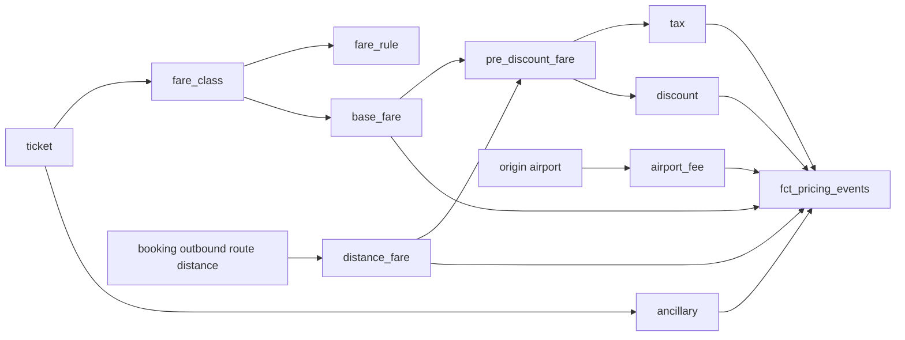

# Airline Products, Services, Prices and Tariffs

## Purpose

Milestone 13 adds a deterministic pricing/tariff layer on top of the Milestone 10 pricing/product
staging tables and the Milestone 12 booking/ticketing layer:

```text
stg_airline__{fare_classes,fare_rules,taxes,airport_fees,discounts,products,services,
  ancillary_services,currencies,exchange_rates}
  + int_booking_current_state, stg_airline__tickets (Milestone 12)
  -> models/intermediate/pricing/int_*.sql (reusable calculations)
  -> models/core/dimensions/dim_{fare_rule,tax,currency,discount,service,product}.sql
  -> models/core/facts/fct_pricing_events.sql
```

It connects ticket segment -> fare class -> fare rule -> base fare -> route/distance component ->
taxes -> airport charges -> discounts -> ancillary services -> priced charge components, reusing
the Milestone 11 route/airport layer and the Milestone 12 booking/ticket layer rather than
rebuilding either.

This milestone does **not** implement invoices or invoice-line calculations, payment allocation,
refunds/adjustments, revenue recognition, billing exceptions, reconciliation, commercial marts, or
dashboards. Those are documented in their own downstream domain files.

## Pricing Architecture



Every pricing calculation is grounded in `scripts/airline_synth/build_billing.py`, the Milestone 9
generator's own ground-truth arithmetic, not an invented airline-industry formula. That script is
billing/invoice logic and is not reused directly (out of scope for this milestone); it is read-only
reference material establishing what "deterministic" means for this dataset.

## Grain: ticket, not ticket segment

Every priced component in this milestone (`base_fare`, `distance_fare`, `tax`, `airport_fee`,
`ancillary`) is scoped to a **ticket** (`ticket_id`), not a `ticket_segment_id`. This is a
deliberate deviation from the Milestone 13 specification's suggested "one row per ticket segment"
starting point, verified directly against `scripts/airline_synth/build_billing.py`:

- `_fare_amount_usd(fare_class, distance_km)` is called once per ticket
  (`for ticket in booking_tickets`), using `route = routes_by_id[booking["route_id"]]` -- the
  booking's single **outbound** route, never `return_route_id`, and never a per-segment distance.
- The tax line (`tax_usd = fare_usd * rate`) and both airport-fee lines are generated inside that
  same per-ticket loop, not per segment.
- `ancillary_services` are sold against a `ticket_id`
  (docs/data_models/airline_synthetic_source_data.md's Relational Flow: "ticket -> ancillary_service
  (0-2 sold per issued ticket)"), never a `ticket_segment_id`.

There is no per-segment fare-apportionment rule anywhere in the Milestone 9 specification --
splitting a round trip's ticket-level fare across its two segments would require inventing one,
which this milestone's own scope boundary rules out ("do not invent airline-industry formulas that
are absent from the synthetic specification"). Ticket-level grain is also what makes the Milestone
14 "expected calculated fare vs. source/commercial charged fare" comparison possible at all, since
`invoice_lines` are themselves per-ticket, never per-segment. Only `discount` sits at a different,
booking-level grain -- see "Discounts" below.

Segment-level display context (cabin, flight timing, origin/destination) remains available by
joining `fct_ticket_segments` on `ticket_id` (Milestone 12); it is intentionally not duplicated
onto every priced-component row, which would create a fan-out/double-counting risk if a consumer
ever summed `amount` grouped by `ticket_segment_id`.

## Fare Formula

```text
base_fare_usd (fare_classes.base_fare_usd)
+
distance_component_usd (fare_classes.per_km_usd * booking's outbound route distance_km)
=
pre_discount_fare_usd
```

This is `scripts/airline_synth/build_billing.py::_fare_amount_usd` exactly:
`fare_class["base_fare_usd"] + fare_class["per_km_usd"] * distance_km`. No industry-standard fare
construct (fuel surcharge, YQ/YR taxes, interline proration, revenue management) is modelled,
because none exists in the Milestone 9 specification.

`int_fare_component_calculation` (grain: `ticket_id`) computes `base_fare_usd`,
`distance_component_usd`, `pre_discount_fare_usd`, and `pre_discount_fare_local` (the same amount
converted into the booking's currency). `tests/business_rules/airline_pricing_fare_formula_sanity.sql`
independently recomputes the formula straight from staging and fails if it ever disagrees with the
model's own output by more than a cent -- a regression guard, not a tautology.

## Taxes

`int_tax_calculation` (grain: `ticket_id`) joins `stg_airline__taxes` on the **country of the
booking's outbound route origin airport** (`dim_airport.country_code` via `dim_route.origin_ident`).
The source's own `stg_airline__taxes.country_code` column carries no documented directionality, but
`stg_airline__airport_fees.amount` is explicitly documented as "applied per departing passenger"
(departure-country semantics); this model applies the same departure-country convention for
internal consistency. In the current dataset `COUNTRY_TAX_TYPES` has exactly one entry (a flat 7%
"Government Passenger Tax") replicated per country by
`scripts/airline_synth/build_pricing.py::build_taxes`, so this assumption never changes which row
is selected -- only how the join is justified.

`percentage_rate` is a fraction applied against `pre_discount_fare_usd` (the full base + distance
fare), matching `build_billing.py`'s `tax_usd = fare_usd * rate` exactly -- not merely
`fare_classes.base_fare_usd` alone. `tax_amount_booking_currency` is the resulting amount converted
into the booking's own currency; `tax_currency_code` (the tax's own country's currency) is
preserved separately for reference.

No tax accounting, remittance, or jurisdictional rulebook is modelled -- this is a single
deterministic percentage-of-fare calculation, matching the source's own "Known Simplifications"
entry: "Taxes are modelled as a single flat government passenger tax percentage per country rather
than a full jurisdictional tax/fee rulebook."

## Airport Charges

`int_airport_charge_calculation` (grain: `(ticket_id, fee_code)`) joins `stg_airline__airport_fees`
on the same booking outbound-route **origin (departure)** airport used for the fare/tax
calculations. Only origin charges are modelled: the staging documentation states the fee is
"applied per departing passenger," and no destination/arrival-fee semantics exist anywhere in the
Milestone 9 specification -- a destination charge would be invented.

This model deliberately does **not** replicate `build_billing.py`'s own invoice-line
simplification, which applies a flat global USD fee amount per ticket regardless of airport
(ignoring `airport_ident` entirely). It instead uses the real, more granular
`stg_airline__airport_fees` data -- already denominated in each airport's own local currency by
`scripts/airline_synth/build_pricing.py::build_airport_fees` -- which is the source-data-driven
"list" charge this milestone's pricing layer is meant to produce. `airport_ident` is preserved
exactly as staged and joined to `dim_airport` here, fulfilling the AirStats-conformance join that
`stg_airline__airport_fees`'s own staging documentation flagged as future work.

## Discounts

Unlike every other component, `discount` is computed at **booking** grain (`charge_scope =
'booking'`), inside `int_booking_charge_components`, because
`scripts/airline_synth/build_billing.py` computes exactly one discount line per booking, off a
`subtotal` summed across every ticket in that booking -- never per ticket or per segment.

```text
subtotal_booking_currency = sum(pre_discount_fare_local) across every ticket in the booking
                             (base + distance fare only -- excludes tax/airport_fee/ancillary)

discount_type = 'percentage'   -> raw = subtotal_booking_currency * value
discount_type = 'fixed_amount' -> raw = value (documented as a fixed USD amount), converted into
                                   the booking's currency

discount_amount_booking_currency = least(raw, subtotal_booking_currency)
```

This matches `build_billing.py` exactly, including the cap
(`discount_amount = min(discount_amount, subtotal)`, so a discount can never exceed -- let alone
invert -- the fare subtotal it was computed from). The discount therefore applies **pre-tax and
fare-only** in its basis (subtotal excludes tax/airport_fee/ancillary), but is **subtracted at the
total level** alongside tax/fee/ancillary in any downstream sum -- it is not re-taxed, and it never
touches ancillary charges. A booking with a null `discount_code` produces no discount row at all.
Corporate-vs-generic discount eligibility (a `CORP-*` discount code only ever appears on a booking
with the matching `corporate_account_id`) is guaranteed by construction in
`scripts/airline_synth/build_bookings.py`; no additional eligibility-enforcement logic is invented
here.

`tests/business_rules/airline_pricing_discount_not_exceeding_subtotal.sql` guards the cap
invariant directly.

## Ancillary Services

`int_ancillary_charge_calculation` (grain: `ancillary_service_id`, matching
`stg_airline__ancillary_services` exactly) prices baggage, seat selection, meals, lounge access,
and upgrade sales already present in the source. `amount = unit_price * quantity`, in
`ancillary_services.currency` as staged -- no invented calculation. `amount_usd = quantity *
stg_airline__services.base_price_usd`, the service catalog's own USD list price (not a currency
conversion of `amount`), giving a stable, source-grounded USD figure consistent with the other
components.

`fulfilment_status` is preserved unchanged, including the two deliberately injected controlled
exceptions (`ancillary_sold_but_not_fulfilled`, `ancillary_fulfilled_but_not_billed` -- see
`docs/data_models/airline_synthetic_exception_catalogue.md`). No fulfilment-driven revenue
recognition is derived from it in this milestone.

## Currency Handling

`macros/convert_currency.sql` implements one narrow, reusable conversion expression:

```text
convert_currency(amount, from_rate_to_usd, to_rate_to_usd, scale=2)
  = cast(round((amount * from_rate_to_usd) / to_rate_to_usd, scale) as decimal(18, scale))
```

matching `scripts/airline_synth/utils.py::convert_usd`'s own convention exactly
(`rate_to_usd` = USD value of one unit of that currency; `amount_usd / rate_to_usd[currency]`
converts USD into that currency). The macro takes both rates as arguments rather than performing
its own join, keeping it a pure expression -- callers join `stg_airline__exchange_rates` (or reuse
`dim_currency`) beforehand. Converting from USD uses `from_rate_to_usd = 1.0` (verified:
`stg_airline__exchange_rates` carries a `USD` row with `rate_to_usd = 1.0`); converting a
non-USD-native amount (e.g. a tax's or airport fee's own local-currency figure) into another
currency passes that currency's own rate as `from_rate_to_usd`. All arithmetic uses
`decimal(18, 2)`, never `float`/`double`, matching the repository's existing no-floats-for-money
convention.

`dim_currency` (grain: `currency_code`) combines `stg_airline__currencies` (name,
`minor_unit_digits`) with `stg_airline__exchange_rates` (`rate_to_usd`, `as_of_date`) -- a 1:1 join
on `currency_code`, so no fan-out. `rate_to_usd` is a **single current rate**, not a time series:
`scripts/airline_synth/build_pricing.py::build_exchange_rates` generates exactly one deterministic
rate per currency as of a fixed `AS_OF_DATE`, so no FX-history/SCD model is built -- doing so would
invent history the source does not provide. `minor_unit_digits` is preserved for reference only:
verified against `scripts/airline_synth/utils.py::round2`, the generator itself always rounds
monetary amounts to a flat 2 decimal places regardless of currency (including JPY, whose
real-world minor unit is 0), so this pricing layer matches that same fixed 2-decimal-place
convention throughout, rather than applying `minor_unit_digits` dynamically (which would invent
more precise behaviour than the source specification implements).
`tests/business_rules/airline_pricing_charge_component_amount_fixed_point.sql` guards that every
computed `amount` in `int_booking_charge_components` carries no more than 2 decimal places of
precision.

- **Source currency**: whatever a given native figure is staged in --
  `fare_classes.base_fare_usd`/`per_km_usd` (USD), `airport_fees.amount`/`taxes.currency_code`
  (the airport's/country's own local currency), `ancillary_services.unit_price`
  (the booking's currency, by construction).
- **Target/reporting currency**: the booking's own currency
  (`int_booking_current_state.currency`) for every `amount` column in
  `int_booking_charge_components`/`fct_pricing_events`, matching how
  `build_billing.py` denominates every `invoice_line`. `amount_usd` is additionally carried as a
  currency-independent audit figure.
- **Exchange-rate convention**: `rate_to_usd` = USD value of one unit of that currency (verified
  against `EXCHANGE_RATE_TO_USD`/`convert_usd` in `scripts/airline_synth/reference.py` /
  `scripts/airline_synth/utils.py`).
- **Effective-date limitation**: `rate_as_of_date` (from `stg_airline__exchange_rates.as_of_date`)
  is the single date every rate was generated as of; there is no rate history to select an
  effective date from.

## Charge-Component Grain and Sign Convention

`int_booking_charge_components` (intermediate) and `fct_pricing_events` (core fact) share the same
grain: one row per priced charge component (`component_key_natural` / `charge_component_key`), a
`UNION ALL` of `base_fare`, `distance_fare`, `tax`, `airport_fee`, `ancillary` (all `charge_scope =
'ticket'`) and `discount` (`charge_scope = 'booking'`).

**Sign convention**: `amount`/`amount_usd` are **positive** for every charge component
(`base_fare`, `distance_fare`, `tax`, `airport_fee`, `ancillary`) and **negative or zero** for
`discount`. Summing `amount` for a `booking_id` therefore yields that booking's net payable total
directly, matching `build_billing.py`'s own
`subtotal + tax_total + fee_total + ancillary_total - discount_amount` arithmetic, without
recalculating anything. This is the intended Milestone 14 handoff surface: an invoice-line
generation model can read `fct_pricing_events` and sum/group it directly rather than re-deriving
fares, taxes, fees, or discounts from source tables again.

`fare_class_key`/`route_key`/`origin_airport_key`/`tax_key`/`service_key`/`discount_key` are
populated only for the component type each key applies to (e.g. `tax_key` only on `tax` rows) --
null elsewhere by construction, not missing data.

No `invoice_id`, `payment_id`, `refund_id`, `adjustment_id`, or revenue-recognition field exists on
`fct_pricing_events`. Those remain out of scope until Milestone 14+.

## Core Dimensions

| Model | Grain | Natural key | Surrogate key |
| --- | --- | --- | --- |
| `dim_fare_class` (Milestone 12, unchanged) | fare class | `fare_class_code` | `fare_class_key` |
| `dim_fare_rule` | fare-class rule set | `fare_rule_id` | `fare_rule_key` |
| `dim_tax` | (country, tax type) | `tax_id` | `tax_key` |
| `dim_currency` | currency | `currency_code` | `currency_key` |
| `dim_discount` | discount code | `discount_code` | `discount_key` |
| `dim_service` | sellable service/ancillary catalog entry | `service_code` | `service_key` |
| `dim_product` | sellable fare bundle | `product_code` | `product_key` |

Dimensions considered and deliberately **not** implemented, per "do not create placeholder
dimensions without a real source/domain role":

- **`dim_ancillary_type`**: no standalone source table exists; `category` is only ever an
  attribute of a service row, so it is retained directly on `dim_service` instead of adding a join
  hop with no additional source authority.
- **`dim_price_plan` / `dim_tariff`**: no standalone `price_plans`/`tariffs` entity exists in the
  Milestone 9 specification (not in the Entity Inventory, not in the reuse list). What this
  milestone calls a "tariff" is the combination of `dim_fare_class` + `dim_fare_rule` +
  `dim_route`'s distance + `dim_tax` + `stg_airline__airport_fees`, not a separate table --
  inventing one would fabricate structure with no source authority.
- **A separate airport-fee-type dimension**: `fee_code`/`fee_name` is a two-row global reference
  (`PSC`, `SEC`) with no other attributes; it is kept inline on `fct_pricing_events` rather than
  split into its own dimension for two rows with no independent role.

`dim_product` has no downstream fact/FK relationship in this dataset -- no Milestone 9 booking or
ticket table carries a `product_code` foreign key (bookings and tickets reference
`fare_class_code` directly). It is still implemented for catalog completeness, since "Products" is
explicit in this milestone's own title, and to preserve the documented `product -> fare_class`
bundling relationship; `included_service_codes` is kept as the staged pipe-delimited text, not
parsed into an array, matching `stg_airline__products`.

## Core Fact

| Model | Grain | Natural key | Surrogate key |
| --- | --- | --- | --- |
| `fct_pricing_events` | priced charge component | `component_key_natural` | `charge_component_key` |

## Controlled Incorrect-Fare Preservation

Milestone 9's `incorrect_fare` controlled exception (see
`docs/data_models/airline_synthetic_exception_catalogue.md`, row 4) overwrites a `base_fare`
**invoice line**'s `amount` to a value inconsistent with
`fare_classes.base_fare_usd + per_km_usd * route distance`
(`scripts/airline_synth/exceptions.py`, lines ~134-153). It lives entirely inside `invoice_lines`
-- a billing-domain table this milestone never reads, references, or joins.

`int_fare_component_calculation.pre_discount_fare_usd` is therefore, by construction, the clean
"expected calculated fare" for every ticket: computed purely from `fare_classes` and route
distance, with no visibility into (and so no possibility of being corrupted by) the `invoice_lines`
exception. This is exactly the comparison surface a later Milestone 14+ exception-detection model
will need: join `fct_pricing_events` (`component_type = 'base_fare'`, `amount_usd`) to the eventual
`invoice_lines` staging/core model on `ticket_id` and flag any ticket where the two disagree by more
than a rounding cent -- which will correctly single out the one exception-affected ticket and
nothing else. This milestone does not build that detection model; it only guarantees the
"expected" side of the comparison is available and untainted.

## Known Simplifications

- Every priced component (`base_fare`, `distance_fare`, `tax`, `airport_fee`, `ancillary`) is
  ticket-scoped, not segment-scoped -- see "Grain: ticket, not ticket segment" above.
- Only the booking's outbound route/origin airport is used for fare distance, tax country, and
  airport-fee lookups, even for round-trip tickets -- matching `build_billing.py`'s own
  never-varies-by-leg behaviour; the return leg's distance/airport/country is not separately
  priced, since the source defines no rule for doing so.
- Tax and airport-fee country/airport applicability is inferred as departure-based (consistent
  with the airport-fee documentation's "applied per departing passenger" wording); the source does
  not state this explicitly for tax.
- No FX rate history: exactly one current `rate_to_usd` per currency, matching the source.
- `minor_unit_digits` is reference-only; every amount is rounded to a flat 2 decimal places,
  matching the generator's own `round2` convention (not each currency's real-world minor unit).
- No product/service pricing beyond what `stg_airline__services.base_price_usd` and
  `stg_airline__ancillary_services` already stage -- `dim_product` has no fact-table FK
  relationship in this dataset (see "Core Dimensions" above).
- `change_fee_usd` (on both `dim_fare_class` and `dim_fare_rule`) remains reference-only; no ticket
  change/re-issue transaction exists anywhere in the Milestone 9 specification to charge it
  against.

## Scope Boundary

This document covers products, services, fares, taxes, fees, discounts, currency handling, and
pricing-event models. Invoicing, payment allocation, refunds/adjustments, revenue recognition,
billing exceptions, reconciliation, and commercial marts are documented in their own downstream
domain files.
