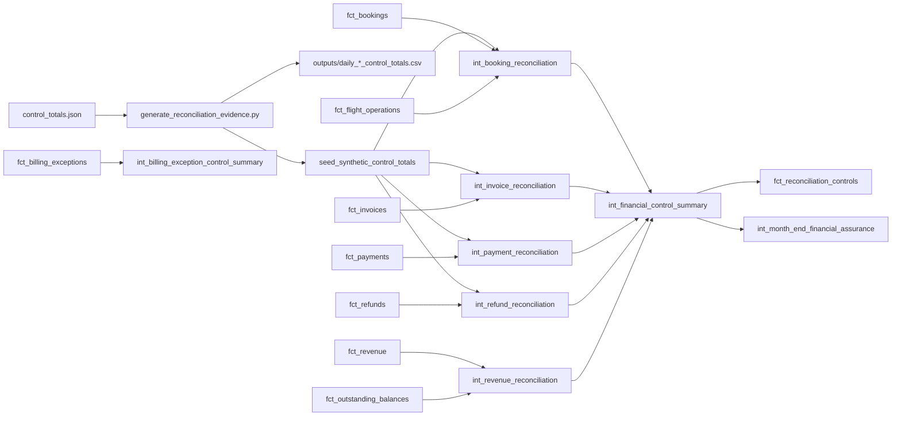

# Airline Reconciliation Controls

## Purpose

Milestone 19 builds a formal reconciliation layer proving whether Milestone 9's synthetic source
control totals and the Milestone 11-18 warehouse analytical layer agree -- entirely by reusing
existing facts:

```text
data/synthetic/control_totals.json
  -> scripts/generate_reconciliation_evidence.py
     -> seeds/reconciliation/seed_synthetic_control_totals.csv (source side, for dbt)
     -> outputs/daily_*_control_totals.csv (offline expected-reconciliation fixtures)
  -> models/intermediate/reconciliation/int_*.sql (source vs. warehouse comparisons)
  -> models/core/facts/fct_reconciliation_controls.sql
```

No pricing, invoice arithmetic, payment allocation, refund logic, or revenue-recognition logic is
recomputed anywhere in this milestone. This milestone does **not** implement commercial reporting
marts, route profitability, executive airline marts, dashboards, or the production dbt-engineering
enhancements reserved for Milestone 21. Those remain planned for Milestone 20 onward (see
"Scope Boundary" below).

## Architecture



## Source-Control Architecture and Provenance

`data/synthetic/control_totals.json` (produced by `scripts/generate_control_totals.py`, Milestone
9) is the **single source-of-truth control artifact**. It is never re-typed by hand anywhere in
this milestone. Because dbt has no native way to query a JSON file directly as a source in this
project (and this milestone's own scope explicitly rejects "pretending JSON is a Snowflake source
table" or "introducing a fake raw Snowflake source just for reconciliation"), `scripts/
generate_reconciliation_evidence.py` mechanically re-expresses the same 14 values in a tidy long
format as a dbt **seed**
(`seeds/reconciliation/seed_synthetic_control_totals.csv`: `metric_name`, `metric_value`,
`as_of_date`) -- this is Option B from the milestone's own scope, chosen because dbt reconciliation
models need something queryable to join against, and a seed is the standard dbt mechanism for a
small, version-controlled, deterministically-generated fixture. Regenerate it by re-running the
script whenever the synthetic dataset changes; `control_totals.json` remains authoritative.

The same script also implements **Option A** (a deterministic Python reconciliation helper) for
the offline `outputs/daily_*_control_totals.csv` evidence -- see "Offline Execution Limitation"
below.

## Reconciliation Grains

| Model | Grain | Key |
| --- | --- | --- |
| `int_booking_reconciliation` / `int_invoice_reconciliation` / `int_payment_reconciliation` / `int_refund_reconciliation` / `int_revenue_reconciliation` / `int_financial_control_summary` | reconciliation control | `control_id` |
| `int_billing_exception_control_summary` | (exception_type, severity, status, currency) | composite |
| `int_month_end_financial_assurance` | single snapshot | none (one row) |
| `fct_reconciliation_controls` | reconciliation control per as-of period | `(control_id, as_of_date)` / `control_key` |

## Direct Source-to-Warehouse Controls

Twelve controls compare `control_totals.json`'s own definitions against warehouse aggregates,
using the exact same field semantics on both sides:

| Control | Source | Warehouse |
| --- | --- | --- |
| `booking.booking_count` | `len(bookings)` | `count(*)` from `fct_bookings` |
| `booking.booking_confirmed_count` / `booking_cancelled_count` | `status` filter on `bookings.csv` | `is_cancelled` filter on `fct_bookings` |
| `ticket.ticket_count` | `len(tickets)` | `count(distinct ticket_id)` from `fct_ticket_segments` |
| `flight_operations.flight_instance_count` / `*_completed_count` / `*_cancelled_count` / `*_scheduled_count` | `flight_instances.status` | `fct_flight_operations.status` (raw, **not** `operational_completion_status`) |
| `invoice.invoice_count` | `len(invoices)` | `count(*)` from `fct_invoices` |
| `invoice.invoice_total_value` | `sum(invoices.total_amount)` | `sum(fct_invoices.source_invoice_total)` (**not** `calculated_invoice_line_total` -- see below) |
| `payment.successful_payment_count` | `len(payments)` | `count(*)` from `fct_payments` |
| `payment.successful_payment_total_value` | `sum(payments.amount)` | `sum(fct_payments.payment_amount)` (raw, **not** `allocated_amount`) |
| `refund.refund_count` | `len(refunds)` | `count(*)` from `fct_refunds` |
| `refund.refund_total_value` | `sum(refunds.amount)` | `sum(fct_refunds.refund_amount)` (raw, **uncapped**) |

Every warehouse-side column above is an **unmodified passthrough or a simple count/filter** of a
raw source field -- none of it recomputes pricing, allocation, or recognition logic. `control_status
= 'pass'` requires exact equality (counts) or a 1-cent tolerance (monetary sums, documented below);
any nonzero result would indicate a genuine modelling defect, not a legitimate business anomaly.

### Why `invoice_total_value` uses `source_invoice_total`, not `calculated_invoice_line_total`

`scripts/generate_control_totals.py` sums `invoices.csv`'s own `total_amount` field directly. The
warehouse-side equivalent is therefore `fct_invoices.source_invoice_total` (the same unmodified
header value), not `calculated_invoice_line_total` (Milestone 14's independently re-summed line
total) -- comparing unlike concepts would be a modelling error, not a genuine control. Invoice-line
arithmetic assurance is kept **separate but visible**: `invoice.invoice_line_arithmetic_consistency`
compares `sum(calculated_invoice_line_total)` against `sum(source_invoice_total)`, both
warehouse-side, with `control_status = 'warning'` (never `'fail'`) when nonzero -- see "Business
Anomaly vs. Reconciliation Failure" below.

## Payment Reconciliation

`payment.successful_payment_count`/`successful_payment_total_value` compare against
`fct_payments` (verified: `control_totals.json`'s own `successful_payment_count` sums every row in
`payments.csv`, "every row in payments.csv is a successful transaction by construction" --
`scripts/generate_control_totals.py`). `fct_payment_attempts` is used only for a **supplementary**
`payment.failed_attempt_count` row (`control_status = 'not_applicable'`, null `source_measure`):
`control_totals.json` has no failed-attempt total to compare against at all, so this is reported as
evidence, never as a pass/fail control.

## Refund Reconciliation

`refund.refund_total_value` sums `fct_refunds.refund_amount` **uncapped** -- Milestone 16
deliberately never caps or corrects a refund's own stored amount (it only exposes
`refund_limit_variance` as separate evidence). This is the exact point this milestone is required
to demonstrate: the deliberately injected `refund_greater_than_collected_amount` controlled
exception's row reconciles **perfectly** here (source `refund.amount` = warehouse
`refund_amount`, both the same unmodified +100-inflated figure) -- see "Business Anomaly vs.
Reconciliation Failure" below.

## Revenue/Financial Bridge

`int_revenue_reconciliation` is deliberately **not** a source-to-warehouse comparison:
`control_totals.json` contains no recognised-revenue total, and invoice total, cash collected, and
net recognised revenue represent genuinely different business/accounting states that are not meant
to equal one another (an invoice can be issued before cash is collected; revenue is recognised only
once a service is fulfilled, independent of both -- see `docs/data_models/
airline_revenue_recognition.md`). Every row has `control_status = 'not_applicable'` and explains,
rather than forces, the difference between:

```text
invoiced_value        -- sum(fct_invoices.source_invoice_total)
collected_cash         -- sum(fct_invoices.amount_collected)
refund_total            -- sum(fct_refunds.refund_amount)
net_adjustment_total   -- sum(fct_invoices.net_adjustment_amount)
net_recognised_revenue -- sum(fct_revenue.net_recognised_amount)
outstanding_balance_total -- sum(fct_outstanding_balances.outstanding_balance)
```

## Month-End Assurance

`int_month_end_financial_assurance` is a single-row snapshot summarising bookings, invoices,
payments, refunds, adjustments, recognised revenue, outstanding balances, and billing exceptions
as of the dataset's own fixed synthetic `as_of_date` (`2026-01-15`, sourced from the seed) -- never
wall-clock-dependent. It is a reporting summary over existing facts, not a new calculation.

## Billing-Exception Control Summary

`int_billing_exception_control_summary` aggregates `fct_billing_exceptions` (Milestone 18) by
`(exception_type, severity, status, currency)`, exposing `exception_count` and
`financial_value_at_risk_total`. No exception is re-detected, reclassified, or recomputed here --
this is reporting over the existing exception fact only.

## Control Statuses

| Status | Meaning |
| --- | --- |
| `pass` | Variance is within `materiality_threshold` -- source and warehouse agree |
| `fail` | Variance exceeds `materiality_threshold` -- a genuine reconciliation defect |
| `warning` | Informational: a known, documented, non-ETL divergence (invoice-line arithmetic only) |
| `not_applicable` | No source-side comparison exists for this row (supplementary evidence or the revenue bridge) |

**Tolerance**: count controls use exact equality (`materiality_threshold = 0`) -- a count cannot
legitimately differ by a fraction. Monetary controls use a **1-cent tolerance**
(`materiality_threshold = 0.01`), documented explicitly: both sides read the identical
cent-precision figures (no SQL rounding difference exists, since every amount is already
`decimal(18, 2)`), but the tolerance defends against sub-cent binary floating-point noise when
Python sums many decimal values during offline evidence generation. It is not a concession to any
real rounding disagreement.

## Business Anomaly vs. Reconciliation Failure

This milestone explicitly distinguishes two different kinds of "something is wrong":

- A **source-to-warehouse reconciliation failure** means the warehouse computed something
  differently from what the source actually contains -- an ETL/modelling defect.
- A **business anomaly** (a Milestone 9 controlled exception) means the source itself contains a
  deliberately unusual value, faithfully carried through to the warehouse unchanged.

`refund_greater_than_collected_amount` is the clearest example: `refunds.csv`'s one deliberately
inflated row (`amount` raised by exactly `100.0` above its linked payment) is summed into
`control_totals.json`'s `refund_total_value` **and** into `fct_refunds.refund_amount` identically --
so `refund.refund_total_value` shows `control_status = 'pass'` (correct: the ETL faithfully
reproduced the anomalous number) while `fct_billing_exceptions` **separately and correctly**
flags that same record as a `refund_greater_than_collected_amount` exception (Milestone 18). Both
are true at once, and neither is a bug. `tests/business_rules/
airline_reconciliation_anomaly_reconciles_despite_exception.sql` guards this exact dual
expectation directly.

The same principle applies to `invoice.invoice_line_arithmetic_consistency`: its nonzero value
reflects the `missing_invoice_line`/`incorrect_fare`/`completed_segment_without_recognised_
revenue_precursor` controlled exceptions (already correctly classified by `fct_billing_exceptions`),
so it is reported as `'warning'`, never `'fail'` -- a reconciliation control must never silently
"repair" a business anomaly by reclassifying it as an ETL error.

## Offline Execution Limitation

No Snowflake connection is used anywhere in this milestone. Two categories of evidence exist:

1. **`outputs/daily_{booking,invoice,payment,refund}_control_totals.csv`**: genuine deterministic
   offline evidence. `scripts/generate_reconciliation_evidence.py` independently recomputes each
   warehouse-side figure directly from the raw synthetic CSVs, using the exact same field/filter
   semantics the corresponding dbt model uses (documented per-metric in the script and in this
   doc) -- since every one of these 12 controls is an unmodified passthrough/count, this offline
   computation is a faithful "expected reconciliation fixture" for what `dbt run` against a real
   warehouse would produce, not a fabrication.
2. **`outputs/revenue_reconciliation.csv` and `outputs/billing_exceptions.csv`**: **schema-only
   fixtures** (a documenting comment line plus column headers, zero data rows). These outputs
   depend on accumulated business logic (payment-allocation capping, revenue-recognition
   eligibility, exception-detection rules) this milestone deliberately does not reimplement in
   Python -- doing so would recompute business logic Milestones 15-18 already implement in dbt,
   and risk silently diverging from what dbt actually computes. They are labelled as requiring
   `dbt run`/`dbt seed` against a live warehouse to populate, never presented as executed results.

`reports/*.md` (see below) state this limitation explicitly wherever relevant.

## Controlled Exception Coverage

This milestone's reconciliation controls are rule-based, computed from `control_totals.json` and
warehouse aggregates -- no record is matched by hard-coded ID anywhere. Coverage is demonstrated
structurally: every one of the twelve direct controls is asserted to `pass`
(`tests/business_rules/airline_reconciliation_direct_controls_pass.sql`), and the one Milestone 9
controlled exception most relevant to this milestone's own scope
(`refund_greater_than_collected_amount`) is explicitly demonstrated to both reconcile and remain
classified as an exception (see above). The remaining thirteen controlled exceptions are within
Milestone 18's own scope (billing-exception detection), not this milestone's -- see
`docs/data_models/airline_outstanding_balances_exceptions.md` for their coverage.

## Scope Boundary

This document covers source-to-warehouse reconciliation, month-end assurance, revenue/cash bridge
logic, and billing-exception control summaries. Commercial marts and executive summaries are
documented in `docs/data_models/airline_commercial_marts.md`; production-oriented dbt engineering
is documented in `docs/engineering/dbt_production_engineering.md`.
