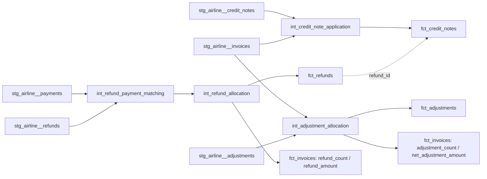

# Airline Refunds and Adjustments

## Purpose

Milestone 16 adds a reliable post-payment financial-adjustment layer on top of the Milestone 10
refund/adjustment/credit-note staging tables and the Milestone 14/15 invoice/payment layers:

```text
stg_airline__{refunds,adjustments,credit_notes}
  + fct_payments, fct_invoices, dim_currency (Milestone 14/15/13, read-only reuse)
  -> models/intermediate/billing/int_{refund_payment_matching,refund_allocation,
     adjustment_allocation,credit_note_application}.sql (reusable calculations)
  -> models/core/facts/fct_{refunds,adjustments,credit_notes}.sql
  -> fct_invoices extended with refund_count/refund_amount/adjustment_count/net_adjustment_amount
```

It connects payment -> refund -> adjustment/credit note -> source financial-movement evidence,
reusing `fct_payments`/`fct_invoices`/`dim_currency` rather than recomputing payment allocation or
invoice arithmetic.

This milestone does **not** implement voucher application, revenue recognition, a final
outstanding-balance model, billing-exception classification, reconciliation, commercial marts, or
dashboards. Those remain planned for Milestone 17 onward (see "Milestone 17 Boundary" below). This
milestone establishes refund/adjustment **structure and evidence** -- calculation, yes;
exception classification, no.

## Refund Architecture



## Grains and Keys

| Model | Grain | Key |
| --- | --- | --- |
| `int_refund_payment_matching` / `int_refund_allocation` | refund | `refund_id` |
| `int_adjustment_allocation` | adjustment | `adjustment_id` |
| `int_credit_note_application` | credit note | `credit_note_id` |
| `fct_refunds` | refund transaction | `refund_id` / `refund_key` |
| `fct_adjustments` | adjustment | `adjustment_id` / `adjustment_key` |
| `fct_credit_notes` | credit note | `credit_note_id` / `credit_note_key` |

## Payment/Refund Relationships

`int_refund_payment_matching` (grain: `refund_id`) `LEFT JOIN`s `stg_airline__refunds` to
`stg_airline__payments` on `payment_id`, so an unmatched refund would be preserved, not dropped --
though verified against `scripts/airline_synth/build_billing.py`, every refund in the current
dataset does resolve to a real payment, in both the normal cancellation flow and the
`refund_greater_than_collected_amount` controlled exception's fallback branch.

`invoice_id`/`booking_id` are preserved directly from `stg_airline__refunds` itself -- both are
native columns on the refunds table (not derived), and both are documented and tested in staging
as always resolving, unlike `stg_airline__adjustments.invoice_id`, which is not.

## Refund-Limit Evidence

```text
refundable_amount_reference = matched_payment_amount

refund_limit_variance = refund_amount - refundable_amount_reference
```

`refundable_amount_reference` is deliberately the specific matched payment's own amount, not an
invoice-level aggregate (e.g. `fct_invoices.amount_collected`): `build_billing.py` always ties a
refund to one specific `payment_id` and sets `refund.amount` to that payment's own collected
amount (`successful_payment_amount`), so the payment is the source's own reference point.

Positive `refund_limit_variance` means the refund exceeds the amount collected on its matched
payment -- calculation evidence for a later milestone to classify, never capped, corrected, or
flagged here. The deliberately injected `refund_greater_than_collected_amount` controlled
exception (see `docs/data_models/airline_synthetic_exception_catalogue.md`) always inflates a
refund by exactly `100.0` above its linked payment's amount
(`scripts/airline_synth/exceptions.py`), so that row's `refund_limit_variance` reads `100.00`
unmodified -- it remains fully visible, per this milestone's explicit requirement.

`cumulative_refunded_amount_for_payment` sums `refund_amount` across every refund matched to the
same `payment_id`. In the current dataset this always equals the single refund's own amount (the
generator never produces more than one refund per payment), but it is computed as a genuine sum,
not a passthrough, matching the same structurally-defensible-but-currently-trivial pattern this
repository has already used for Milestone 11's `other` completion status and Milestone 12's
`not_flown` journey status.

## Adjustment Semantics

`stg_airline__adjustments` carries no `booking_id`/`ticket_id` column of its own -- adjustments are
invoice-level only in this specification. `int_adjustment_allocation` `LEFT JOIN`s
`stg_airline__adjustments` to `stg_airline__invoices` on `invoice_id`, deriving `booking_id` via
the matched invoice (null when unmatched, correctly reflecting that the `invalid_adjustment`
exception's row has no resolvable booking either).

### Sign Convention

Verified against `scripts/airline_synth/build_billing.py::build_billing_documents` (the only place
adjustments are generated in the normal flow): every `credit`-type adjustment is a **negative**
amount (`"amount": -adjustment_amount`), decreasing the amount due -- matching ordinary accounting
convention for a credit. No `debit`-type adjustment is ever produced by the current generator;
`debit` is a defined-but-currently-unused value in `stg_airline__adjustments.adjustment_type`'s own
accepted domain (staging documents it as valid, so it is included here, never fabricated).

`has_expected_sign_for_type` is `true` when `adjustment_type = 'credit'` and `amount <= 0`, or
`adjustment_type = 'debit'` and `amount >= 0`.

### Invalid-Adjustment Evidence

The deliberately injected `invalid_adjustment` controlled exception is **two** anomalies in one
row, both preserved and both independently observable:

1. `invoice_id = 'INV-99998'` does not exist -> `has_invoice_match = false`.
2. `adjustment_type = 'credit'` with `amount = +999999.0` (positive) -- the **opposite** sign of
   every normal credit adjustment -> `has_expected_sign_for_type = false`.

Neither is classified as a billing exception here; both are exposed as structural evidence
(`has_invoice_match`, `has_supported_adjustment_type`, `is_currency_match`,
`has_expected_sign_for_type`, `amount`) for a later milestone to classify.

## Credit-Note Handling

A credit note in this dataset is a **paper-trail document evidencing a refund**, not an
independent invoice-application/allocation instrument. Verified against `build_billing.py`, every
`credit_notes` row is created in the same code block as its refund, with `credit_note.amount` set
to the identical `successful_payment_amount` value used for that refund, and `credit_note.refund_id`
always populated. `credit_note.adjustment_id` is **always empty/null** in the current dataset -- no
code path in `build_billing.py` or `exceptions.py` ever creates a credit note tied to an
adjustment, even though the staged schema supports it (`stg_airline__credit_notes.adjustment_id`
exists and is nullable).

Per this milestone's own scope boundary ("If credit notes are not directly applied to invoices in
source semantics, document that limitation rather than inventing an allocation rule"), no
allocation/application rule is invented here: `int_credit_note_application` preserves the credit
note's own fields and exposes `has_refund_link` / `has_adjustment_link` as structural evidence
(always `true`/`false` respectively in the current dataset).

`fct_credit_notes` is implemented as a **standalone fact**, not merged into `fct_refunds`, because
a credit note is its own distinct document type in the source -- its own natural key, its own
status lifecycle, and a schema that in principle allows it to relate to either a refund or an
adjustment. `adjustment_key` is still joined defensively so this fact keeps working correctly if
that generator behaviour ever changes.

**Known divergence, not reconciled here**: `scripts/airline_synth/exceptions.py`'s
`refund_greater_than_collected_amount` exception mutates only the linked refund's `amount`, never
the paired credit note's `amount`. If the affected refund already had a credit note from the
normal flow, that credit note's `amount` may no longer equal its refund's (now-inflated) amount.
`int_credit_note_application` does not detect, reconcile, or flag this -- it is preserved exactly
as staged, available for a later milestone to compare if useful.

## Sign and Currency Handling

| Field | Sign convention |
| --- | --- |
| `refund_amount` | Always positive -- money returned to the customer (verified: `build_billing.py` never produces a negative refund) |
| `adjustment.amount`, `adjustment_type = 'credit'` | Negative -- decreases amount due |
| `adjustment.amount`, `adjustment_type = 'debit'` | Positive -- increases amount due (no such row currently exists) |
| `fct_invoices.net_adjustment_amount` | Straight sum of `adjustment.amount` using its native sign -- a negative net means the invoice's amount due was net-reduced |

Currencies are preserved exactly as staged; no conversion is applied anywhere in this milestone.
`dim_currency` is reused for conformance (`currency_key` on all three new facts).
`is_currency_match` evidence follows the same pattern Milestone 15 established for payments:
`refund.currency` vs. its matched payment's currency; `adjustment.currency` vs. its matched
invoice's currency; `credit_note.currency` vs. its matched invoice's currency -- each `null` (not
`false`) when there is nothing to compare against. No FX gain/loss accounting is modelled.

## Financial Movement vs. Revenue Treatment

Every measure in this milestone -- `refund_amount`, `net_adjustment_amount`, `amount` on
`fct_credit_notes` -- describes a **cash/credit movement that has already been recorded in the
source data**, not a recognised-revenue adjustment. This repository has no revenue-recognition
model yet (that begins in Milestone 17), so none of these figures should be read as "revenue was
reduced by X" -- only as "the source recorded a refund/adjustment/credit note of this amount,
against this invoice, with this sign." Milestone 17 is what will translate financial movements
into revenue-recognition terms, once a recognition policy exists to interpret them against.

## Controlled Anomaly Preservation

Two Milestone 9 controlled exceptions are directly in this milestone's scope (see
`docs/data_models/airline_synthetic_exception_catalogue.md`), and both are preserved unrepaired,
undeduplicated, and unclassified:

- **`refund_greater_than_collected_amount`**: a refund's amount raised by exactly `100.0` above
  its linked payment's amount. Observable as `int_refund_allocation.refund_limit_variance = 100.00`
  on that row.
- **`invalid_adjustment`**: an adjustment referencing a non-existent invoice
  (`invoice_id = 'INV-99998'`) with an implausibly large, sign-inconsistent amount
  (`credit` type, `+999999.0`). Observable as `has_invoice_match = false` **and**
  `has_expected_sign_for_type = false` on that row -- two independent signals, both preserved.

`tests/business_rules/airline_refund_adjustment_controlled_anomalies_present.sql` guards all
three signatures (the two above, split into their invoice-match and sign-mismatch components)
directly, failing if any of them is ever accidentally filtered out, joined away, or "corrected" by
a future change.

## Known Simplifications

- Refund allocation is single-payment-per-refund only, matching the source exactly -- no
  multi-payment/split-refund concept exists or is modelled.
- Credit notes are evidence documents only in this dataset; no application/allocation logic against
  invoice lines is modelled, since the source provides none to model.
- `fct_invoices`'s new measures (`refund_count`, `refund_amount`, `adjustment_count`,
  `net_adjustment_amount`) are neutral financial-movement rollups, **not** an outstanding-balance
  calculation -- see `fct_invoices.sql`'s model comment for why that calculation is deliberately
  deferred to Milestone 18.
- Vouchers (`stg_airline__vouchers`) are explicitly out of scope for this milestone, per the
  critical scope boundary.

## Milestone 17 Boundary

Milestone 17 (Revenue Recognition) is the next planned milestone. It is expected to build a
recognition policy on top of the complete financial-movement picture this repository now has
(fares/taxes/fees/ancillaries/discounts from Milestone 13, invoices from Milestone 14, payments
from Milestone 15, and refunds/adjustments/credit notes from this milestone), translating source
financial movements into recognised-revenue terms for the first time. A final `outstanding_balance`
model, billing-exception classification (including formally classifying the anomalies preserved
in Milestones 14-16), reconciliation controls, commercial marts, and dashboards remain out of
scope until their own later milestones (18-20), per the existing roadmap.
