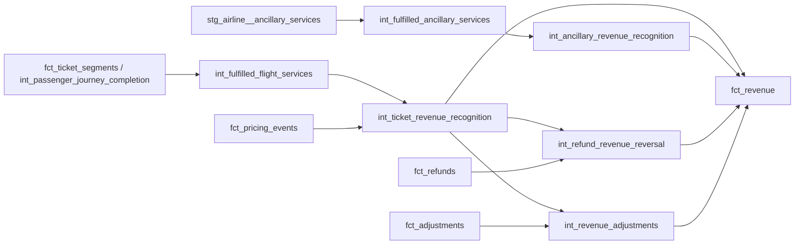

# Airline Revenue Recognition

## Purpose

Milestone 17 adds a service-fulfilment-driven revenue layer on top of the Milestone 11-16
operations, booking/ticketing, pricing, invoice, payment, and refund/adjustment layers:

```text
int_passenger_journey_completion (M12) + int_ancillary_charge_calculation (M13)
  -> models/intermediate/revenue_recognition/int_fulfilled_{flight,ancillary}_services.sql
  -> models/intermediate/revenue_recognition/int_{ticket,ancillary}_revenue_recognition.sql
  + fct_refunds, fct_adjustments (M16, read-only reuse)
  -> models/intermediate/revenue_recognition/int_refund_revenue_reversal.sql
  -> models/intermediate/revenue_recognition/int_revenue_adjustments.sql
  -> models/core/facts/fct_revenue.sql
```

Revenue is recognised because the underlying transport or ancillary service was **fulfilled**, not
because a booking exists, a ticket was issued, an invoice was issued, or a payment was collected.
This milestone does **not** implement final outstanding balances, billing-exception classification,
reconciliation, commercial marts, route profitability, executive reporting, or dashboards. Those
remain planned for Milestone 18 onward (see "Milestone 18 Boundary" below).

## Recognition Architecture



## Recognition Policy

### Passenger Transport

A ticket's fare is recognised **only when every one of its ticket segments is fulfilled**
(`int_fulfilled_flight_services.fulfilment_indicator = true` for all of them, itself
`journey_completion_status = 'completed'` reused unchanged from Milestone 12). `booking_status =
confirmed`, `ticket issued`, `invoice issued`, and `payment collected` are deliberately **not**
used as recognition triggers anywhere in this milestone.

### Ancillary Services

An ancillary sale is recognised only when `stg_airline__ancillary_services.fulfilment_status =
'fulfilled'`. "Sold" (every row's mere existence) is never treated as equivalent to "fulfilled" --
see `int_fulfilled_ancillary_services`'s explicit `is_sold` (always true) vs. `fulfilment_indicator`
columns.

### Cancelled / Non-Flown Segments

A ticket with any cancelled or still-scheduled (non-flown) segment recognises **zero** normal
transport revenue -- `int_ticket_revenue_recognition.recognised_amount = 0` whenever
`is_recognition_eligible` is false. Refund/reversal treatment is handled explicitly and separately
by `int_refund_revenue_reversal` (see "Refund Reversals" below), never conflated with recognition
eligibility itself.

## Ticket Recognition Grain Decision

Grain is **one row per ticket** (`ticket_id`), not `ticket_segment_id`, matching Milestone 13's own
ticket-scoped fare-pricing grain (`int_fare_component_calculation`, `fct_pricing_events`). Milestone
13 already established that no per-segment fare-apportionment rule exists anywhere in the Milestone
9 specification: a ticket's fare is priced once, using the booking's outbound route distance,
regardless of one-way vs. round-trip. This milestone follows the same constraint and chose the
first of the two defensible approaches this milestone's own scope offered: **recognise the
ticket-level fare only when every eligible segment is fulfilled.** A round-trip ticket with one
flown leg and one still-scheduled or cancelled leg is therefore **not** eligible -- recognising half
a round-trip fare would require inventing a pro-rata split the source does not define, which this
milestone's scope boundary explicitly forbids ("Do NOT invent arbitrary pro-rata allocation").

`priced_fare_amount` is reused, not recomputed, from `fct_pricing_events`
(`sum(amount) where component_type in ('base_fare', 'distance_fare')`) -- the same combined figure
Milestone 14 already established as comparable to the source's single `base_fare` invoice line.

`recognition_date = max(flight_date)` across the ticket's own segments -- the date the *last*
fulfilled leg actually flew, i.e. the date the whole itinerary became earned. It is `null` whenever
`is_recognition_eligible` is false. No "actual" flight timestamp exists anywhere in the Milestone 9
specification (only scheduled times and `flight_date`), so no more precise date is fabricated.

## Ancillary Revenue Recognition

Grain is one row per ancillary sale (`ancillary_service_id`), matching the source exactly.
`recognised_amount = amount` when `fulfilment_indicator`, else `0`. `purchase_date_utc` is
preserved under its own honest name, never renamed to a "recognition date": it is the date the
ancillary was **sold**, not a distinct fulfilment timestamp -- no such event/timestamp exists
anywhere in the Milestone 9 specification.

## Refund Reversals

A refund does **not** automatically reverse already-recognised revenue.
`int_refund_revenue_reversal.related_recognised_revenue` sums
`int_ticket_revenue_recognition.recognised_amount` across every ticket under the refund's own
`booking_id` (a refund is booking-scoped in the source, not tied to one specific ticket -- see
`docs/data_models/airline_refunds_adjustments.md`). `reversal_eligibility` is true only when that
sum is positive.

Verified against `scripts/airline_synth/build_billing.py`: a refund is only ever generated for a
**cancelled** booking with a successful payment, and a cancelled booking's ticket segments are
cancelled throughout (never flown) -- so `reversal_eligibility` is expected to be **false**, and
`reversal_amount` **0**, for essentially every refund in the current dataset. This is the correct,
source-grounded outcome, not a bug: a refund for a service that was never rendered has no
recognised revenue to reverse in the first place.

`reversal_amount = least(refund_amount, related_recognised_revenue)` when eligible, else `0` --
never reversing more recognised revenue than is defensibly associated with the refund's booking,
matching this repository's established `least()`-capping pattern (Milestone 13's discount capping,
Milestone 15's payment allocation capping).

## Revenue Adjustments

Not every adjustment is revenue-affecting by default. `int_revenue_adjustments.
revenue_impact_indicator` is true only when the adjustment resolves to a real invoice/booking
(`has_invoice_match` -- so the deliberately injected `invalid_adjustment` exception is
automatically excluded) **and** that booking has positive `related_recognised_revenue` -- the same
"only impacts revenue if revenue exists to impact" principle applied to refund reversals, extended
here for consistency, not a newly invented rule.

`recognised_adjustment_amount` preserves `adjustment.amount`'s own native sign (see "Sign
Convention" below) while capping its magnitude at `related_recognised_revenue`, so an adjustment
can never remove more revenue than was actually recognised for its booking.

## Sign Convention

| Field | Convention |
| --- | --- |
| `gross_recognised_amount` | Always >= 0 (a positive new recognition; 0 when ineligible/unfulfilled -- never negative) |
| `reversal_or_adjustment_amount`, `refund_reversal` rows | Always <= 0 (a reversal always reduces recognised revenue) |
| `reversal_or_adjustment_amount`, `revenue_adjustment` rows | Carries the adjustment's own native sign -- verified against `build_billing.py`: `credit` = negative (decreasing amount due), `debit` = positive (no such row currently exists) -- see `docs/data_models/airline_refunds_adjustments.md` |
| `net_recognised_amount` | `gross_recognised_amount + reversal_or_adjustment_amount` -- the single signed net effect on recognised revenue for that row, directly summable across the whole fact |

This directly matches the milestone's own example convention ("positive = revenue recognition,
negative = reversal / reduction") using the real generator sign semantics as authority, not an
imposed external accounting convention.

## Invoice/Payment Separation

Revenue recognition and invoicing remain **conceptually separate** throughout this milestone. A
service may be:

- **Fulfilled but not billed**: the deliberately injected
  `completed_segment_without_recognised_revenue_precursor` controlled exception removed the
  `base_fare` invoice line for a flown ticket. That ticket's segment is still fulfilled
  (`segment_status = 'flown'`), so `int_ticket_revenue_recognition` still recognises its fare
  normally -- `fct_revenue` shows a positive `gross_recognised_amount` for it, despite
  `fct_invoice_lines` having no corresponding `base_fare` row for that ticket at all. This is
  revenue recognition working exactly as intended: recognition depends on fulfilment, never on
  whether a commercial invoice line happens to exist.
- **Billed but not fulfilled**: nothing in this milestone forces an invoiced amount to equal a
  recognised amount. A ticket that is fully invoiced but whose segments have not yet flown (still
  `scheduled`) recognises `0` gross revenue, regardless of what `fct_invoices`/`fct_invoice_lines`
  already show as billed.

This milestone deliberately does **not** force one-to-one equality between invoice amount and
recognised revenue anywhere -- that comparison, and its classification as a billing exception,
belongs to Milestone 18.

## Payment Separation

Payment collection is never a recognition trigger. No model in this milestone reads
`fct_payments`/`fct_payment_attempts` at all -- cash collection (Milestone 15) and earned revenue
(this milestone) are kept structurally separate, with no shared join path that could let a
successful payment silently gate recognition.

## Recognition Controls

The following controls are enforced by construction (via the `case`/capping logic in the
intermediate models) and independently guarded by regression tests that recompute them from raw
source signals, bypassing the intermediate models entirely:

```text
completed transport service  -> eligible for recognition (all segments fulfilled)
cancelled/non-flown service  -> zero normal transport recognition
unfulfilled ancillary        -> zero ancillary recognition
refund reversal <= related recognised amount
```

`tests/business_rules/airline_revenue_recognition_arithmetic_sanity.sql` recomputes both the
ticket and ancillary recognition amounts directly from `int_fulfilled_flight_services`/
`fct_pricing_events` and `stg_airline__ancillary_services`, bypassing
`int_ticket_revenue_recognition`/`int_ancillary_revenue_recognition` entirely, and fails on any
disagreement with `fct_revenue`'s own output.
`tests/business_rules/airline_revenue_reversal_not_exceeding_recognised.sql` independently
verifies the refund-reversal cap directly against `fct_revenue`.

## Controlled Anomaly Preservation

Three Milestone 9 controlled exceptions are directly relevant to this milestone (see
`docs/data_models/airline_synthetic_exception_catalogue.md`), and this milestone preserves the
observable evidence of all three, without repairing them or classifying them as billing exceptions:

- **`completed_segment_without_recognised_revenue_precursor`**: preserved by *not* "repairing" the
  condition with an invented commercial event -- `fct_revenue` recognises the fare normally (the
  segment did fly), while `fct_invoice_lines` still has no matching `base_fare` row. Both facts
  stay exactly as their own upstream models produce them; neither is patched to agree with the
  other.
- **`ancillary_sold_but_not_fulfilled`**: an ancillary forced to `fulfilment_status =
  'not_fulfilled'` on an otherwise-flown ticket is never billed as recognised revenue here --
  `int_ancillary_revenue_recognition.recognised_amount = 0` for it, exactly as fulfilment-based
  recognition requires. Verified against `scripts/airline_synth/build_bookings.py::
  build_ancillary_services`: a `not_fulfilled` ancillary can only naturally occur on a ticket whose
  segments never flew at all (`not any_flown`), so a `not_fulfilled` ancillary attached to a ticket
  that *did* fly (`is_recognition_eligible = true`) is a combination the normal generator can never
  produce -- making it a precise, non-hardcoded signature for this specific controlled exception.
- **`ancillary_fulfilled_but_not_billed`**: a fulfilled ancillary whose invoice line was removed is
  never invented into existence to reconcile the two -- `int_ancillary_revenue_recognition` still
  recognises it normally (fulfilment is fulfilment, regardless of billing), while
  `fct_invoice_lines` correctly has no matching row for it.

`tests/business_rules/airline_revenue_controlled_anomaly_evidence.sql` guards all three signatures
directly, failing if any of them is ever accidentally filtered out, joined away, or "corrected" by
a future change.

## Limitations

- No per-segment fare apportionment: a round-trip ticket's fare is recognised as one indivisible
  unit, never split between its two legs.
- No precise ancillary "fulfilled at" timestamp exists in the source; `purchase_date_utc` is
  preserved honestly as a sale date, not repurposed as a recognition date.
- `reversal_eligibility`/`revenue_impact_indicator` are expected to be false for nearly every
  refund/adjustment in the current dataset, since normal refunds only arise from pre-flight
  cancellations (nothing was ever recognised to reverse) -- this is a property of the current
  synthetic dataset's generation logic, not a limitation of the model itself.
- No revenue-recognition-vs-invoice or revenue-recognition-vs-payment classification/exception
  model exists yet; this milestone exposes evidence only.

## Milestone 18 Boundary

Milestone 18 (Outstanding Balances and Billing Exceptions) is the next planned milestone. It is
expected to build the first true `outstanding_balance` model (netting `fct_invoices.
amount_collected` against `fct_refunds`/`fct_adjustments`, now that both exist), and to formally
classify the anomalies preserved across Milestones 14-17 (`missing_invoice_line`, `incorrect_fare`,
`completed_segment_without_recognised_revenue_precursor`, `unallocated_payment`,
`payment_without_invoice`, `currency_mismatch`, `refund_greater_than_collected_amount`,
`invalid_adjustment`, `ancillary_sold_but_not_fulfilled`, `ancillary_fulfilled_but_not_billed`)
into a `billing_exception_type`/severity/financial-value-at-risk model for the first time.
Reconciliation controls, commercial reporting marts, route profitability, executive reporting, and
dashboards remain out of scope until their own later milestones (19-20), per the existing roadmap.
