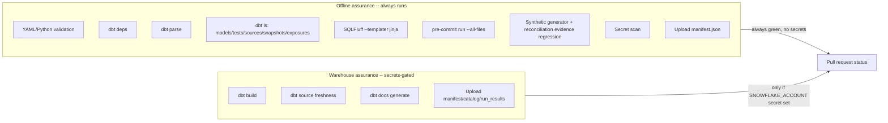

# dbt Production Engineering

## Purpose

Milestone 21 hardens the dbt project for production-style analytics engineering without
pretending a live Snowflake production deployment exists. Every decision below was made against
the actual installed dbt version (1.9.11), the actual pinned packages (`requirements.txt`,
`packages.yml`), and the actual synthetic source data (`scripts/airline_synth/*`) -- nothing here
is speculative. This milestone does not change core business definitions, add new business
domains, redesign completed marts, add dashboards, or perform README polish; those are out of
scope (dashboards/portfolio polish belong to Milestone 22).



## 1. Contract Policy

### Decision

Nine models carry an enforced dbt model contract (`config: {contract: {enforced: true}}`):
`dim_airport`, `dim_route`, `fct_flight_operations`, `fct_bookings`, `fct_invoice_lines`,
`fct_payments`, `fct_revenue`, `fct_billing_exceptions`, `fct_outstanding_balances`.

These are the eight priority models named in the milestone's own scope, plus
`fct_outstanding_balances` (one of the two "potentially include" candidates). Every column
produced by each contracted model's final `select` is declared in its YAML with a `data_type`
that matches the column's actual SQL output type, verified against the actual `CAST`s in the
model (or its upstream staging layer, traced by hand) -- never a speculative or "probably fine"
type. A small Python cross-check (comparing each contracted model's YAML column list against a
regex-extracted list of its SQL file's final `select` columns) confirmed exact name-and-order
agreement for all nine models before this milestone's validation pass.

### `fct_reconciliation_controls` was deliberately NOT contracted

This was the second "potentially include" candidate, and it was assessed and rejected. Its
`source_measure`/`warehouse_measure`/`variance_amount` columns are a `UNION ALL` of five
differently-typed domain reconciliation models: booking/flight counts are raw integers,
`int_invoice_reconciliation` casts its comparison to `decimal(38,6)`, and
`int_revenue_reconciliation` casts to `decimal(18,2)`. Pinning one contract data type here would
either silently truncate the invoice domain's wider precision or imply false precision on the
count-based rows. This milestone's own instruction to "avoid speculative precision/types" applies
directly: rather than invent a type that happens to compile, this fact is left uncontracted, and
that decision is documented here instead.

### One SQL change made to support a contract

`fct_flight_operations.load_factor` previously computed a guarded division
(`passengers_carried / seats_available`) with no explicit cast, leaving its Snowflake-inferred
type implicit. It now casts the result to `decimal(9,6)`, matching the precision every downstream
mart already independently re-casts it to. The value is unchanged; only its declared precision is
now pinned at the source instead of relying on implicit coercion under contract enforcement.

### Why not more, why not fewer

"Do not add contracts mechanically to every model" is an explicit instruction. Staging and
intermediate models are excluded by design -- they are internal transformation layers, not
governed consumption contracts (see `docs/architecture/development_standards.md`'s own layer
responsibilities). Marts are excluded too: they already carry a strong consumption-contract test
suite from Milestone 20 (grain uniqueness, non-null keys, relationships, rate bounds, revenue
arithmetic), and most mart columns are themselves simple aggregates of already-contracted core
columns -- a second layer of contract enforcement there would be duplicative, not additive.

## 2. Surrogate-Key Macro Policy

### Decision: keep `dbt_utils.generate_surrogate_key` direct usage; no project wrapper

All 33 surrogate-key generation call sites in this project use the exact same pattern:
`{{ dbt_utils.generate_surrogate_key([...]) }} as <entity>_key`, generated exactly once in the
key's owning model and reused via `ref()`/joins everywhere else (the established
single-generation-point pattern from Milestone 11 onward). There is no inconsistency to fix: no
model uses a different hashing macro, a different key-naming convention, or generates the same
key more than once. A project wrapper macro (e.g. `generate_airline_surrogate_key`) would add a
layer of indirection with no behavioural or consistency benefit -- it would just rename
`dbt_utils.generate_surrogate_key` while doing exactly the same thing. This is the textbook case
the milestone's own instruction anticipates: "If direct usage is already consistent and
preferable, keep it."

## 3. Reusable Business Macro Policy

### Decision: no new business-logic macro added; `convert_currency` is preserved unchanged

Every candidate macro named in the milestone's own list was checked against actual model code:

| Candidate | Where it is computed | Duplicated elsewhere? |
| --- | --- | --- |
| `convert_currency` | `macros/convert_currency.sql` | **Yes** -- 6 call sites across 4 models (`int_booking_charge_components`, `int_tax_calculation` x2, `int_airport_charge_calculation` x2, `int_fare_component_calculation`). Already a macro; kept unchanged. |
| `calculate_outstanding_balance` | `int_outstanding_balance.sql` only | No -- computed once, reused via `ref()` everywhere else (`fct_outstanding_balances`, marts). |
| `classify_payment_attempt` | `int_payment_attempt_classification.sql` only | No -- computed once, reused via `ref()` in `int_failed_payment_attempts`, `int_billing_exceptions`, `int_payment_reconciliation`, `fct_payment_attempts`. |
| `calculate_invoice_variance` | Two genuinely different calculations (`int_invoice_calculation`'s header-vs-lines variance and `int_invoice_charge_comparison`'s pricing-vs-invoice variance) | No -- they share terminology, not logic; a shared macro would falsely conflate two distinct business comparisons. |
| `calculate_load_factor` | `fct_flight_operations.sql` only | No -- computed once at the fact layer; marts that report a load factor either pass it through or average it, never re-derive the formula. |
| `classify_exception_severity` | `int_billing_exceptions.sql` only | No -- computed once, reused via `ref()` in `fct_billing_exceptions` and `int_billing_exception_control_summary`. |

Every candidate except `convert_currency` is a **single-generation-point** computation already
correctly implemented once and reused via `ref()` -- exactly the pattern this project has followed
since Milestone 11. Converting any of them into a macro would not reduce duplication (there is
none to reduce); it would only relocate an already well-placed computation for no readability or
consistency gain, which the milestone's own instruction explicitly forbids ("do NOT move logic
into macros merely to increase macro count").

A genuinely repeated **coding pattern** was also found -- guarded division
(`case when denominator > 0 then numerator / denominator end`) appears independently in
`fct_flight_operations.load_factor` and in roughly twenty Milestone 20 mart columns
(`completion_rate`, `cancellation_rate`, `revenue_per_passenger`, `revenue_per_flight`,
`average_ticket_value`, and more). A `safe_divide(numerator, denominator, scale)` macro would be
a defensible readability win in isolation. It was **not** extracted here: doing so would mean
retrofitting roughly twenty already-completed, already-tested Milestone 20 mart files, which is
explicitly out of this milestone's scope ("do NOT redesign completed marts", "preserve all
existing business logic"). This assessment is recorded here so a future milestone can make that
call deliberately, with the evidence already gathered.

## 4. Incremental Strategy

### Models made incremental

| Model | `unique_key` | Filter column | Strategy |
| --- | --- | --- | --- |
| `fct_payment_attempts` | `payment_attempt_id` | `attempt_datetime_utc` | `merge` |
| `fct_payments` | `payment_id` | `payment_datetime_utc` | `merge` |
| `fct_refunds` | `refund_id` | `refund_datetime_utc` | `merge` |
| `fct_revenue` | `['event_type', 'source_event_id']` | `event_date` | `merge` |

All four reuse the same var-controlled lookback window: `var('incremental_lookback_days', 3)`
(declared in `dbt_project.yml`; override per-environment with `--vars`). Each model's incremental
branch is a small, isolated addition -- a `source_data` CTE (the model's pre-existing upstream
select, unchanged), an `incremental_cutoff` CTE (only rendered when `is_incremental()`), and a
`classification`/`allocation`/`joined` CTE that either filters against the cutoff (incremental
run) or passes `source_data` through unfiltered (full-refresh/first run). No pre-existing
business-logic CTE was altered to make this work.

### Why these four, not others

`payment_attempts`, `payments`, `refunds`, and `revenue events` are the four entities the
milestone itself named as candidates, and all four share the property that makes incremental
materialisation defensible: each row is an **immutable transaction event** with a genuine business
timestamp (not a synthetic "loaded_at") and a stable natural key. A payment attempt, a payment, a
refund, and a revenue-recognition event are all written once and never mutated afterward in this
domain model -- exactly the shape incremental+merge is designed for.

`billing_exceptions` was the fifth named candidate and was **explicitly rejected**:
`fct_billing_exceptions` re-evaluates current state across many upstream facts on every run
(`int_billing_exceptions` reuses Milestone 14-17 evidence directly), and its `status` column is a
single deterministic `'open'` placeholder with no resolution workflow in this dataset. An
append-only incremental could add newly detected exceptions but could never retract one that no
longer applies -- a correctness risk this milestone does not accept for a financial-control fact.
It remains a full-refresh table. `fct_outstanding_balances` was assessed for the same reason and
excluded on the same grounds (see its own YAML `description` for the model-specific rationale).

### Late-arriving strategy

The lookback window (default 3 days) re-scans the last N days of already-materialized data on
every incremental run, so a source row that arrives after its own natural event date -- but within
the window -- is picked up and merged (not silently missed). A row that arrives later than the
window would be missed by an incremental run; a `--full-refresh` recovers it. This mirrors, at the
ETL-engineering level, the same "late arrival" concept the business layer already models via the
`late_arriving_payment` controlled exception (Milestone 9/18) -- the two are related but distinct
concerns: one is a business-timing anomaly *within* the data, the other is an ETL-pipeline
guarantee *about* the data.

### Known caveat: `fct_refunds.cumulative_refunded_amount_for_payment`

This column is a window aggregate computed over **all** of a payment's refunds in
`int_refund_allocation`. When a new refund for a payment arrives after an earlier refund for the
*same* payment has already been merged into the incremental table, only the new row receives the
freshly recomputed cumulative value -- the earlier row's value is not retroactively updated. A
`--full-refresh` recomputes every row consistently. See the runbook's "Failed Incremental
Recovery" section for when to reach for one.

### Full-refresh recovery

Every incremental model here has never executed against a live warehouse (see "Operational
Limitations" below). The first deployment run of each **must** use `dbt run --select
fct_payment_attempts fct_payments fct_refunds fct_revenue --full-refresh` (or `dbt build`'s own
`--full-refresh` flag) to materialize the initial table; subsequent runs use the incremental path
automatically via `is_incremental()`.

### Schema-change handling

All four use `on_schema_change='fail'` -- a schema drift between the incremental model's compiled
column set and the already-materialized table's columns stops the run rather than silently adding
or dropping columns. This is the conservative choice for financial-control facts: a silent
`append_new_columns` could mask a real upstream contract break. A future migration must run
`--full-refresh` after any column change, documented in the runbook.

## 5. Snapshot Strategy

### Snapshots added

Four new `check`-strategy snapshots under `snapshots/airline/`: `snap_fare_rules`,
`snap_airport_fees`, `snap_taxes`, `snap_corporate_accounts`.

### Why `check`, never `timestamp`

The Milestone 9 synthetic source generator (`scripts/airline_synth/*.py`) was inspected directly
for an `updated_at`/equivalent field on every candidate entity. None exists anywhere in the
specification -- the only timestamp-shaped fields present anywhere in the generator are business
event timestamps (`attempt_datetime_utc`, `payment_datetime_utc`, `refund_datetime_utc`,
`created_at_utc` on adjustments), none of which represent "when this reference record was last
changed." Fabricating an `updated_at` field purely to demonstrate the `timestamp` strategy is
explicitly forbidden by this milestone's own instructions, so every new snapshot uses `check`
instead, tracking every non-key column -- exactly the strategy the existing AirStats snapshots
(`snap_airports`, `snap_runways`) already established for the same reason.

### Why these four entities

`fare_rules`, `airport_fees`, `taxes`, and `corporate_accounts` are small, reference/config-like
entities with a stable natural key and genuinely mutable business attributes (a fare rule's
refundability or change fee, a tax's percentage rate, a corporate account's negotiated discount)
-- exactly the kind of slowly-changing dimension data a real airline's commercial/finance team
would revise over time.

### Entities assessed and rejected: `invoice_status`, `ticket_status`, `route_status`,
`aircraft_assignment`

These four were also named as candidates and were rejected for two independent reasons. First,
none of them is a distinct staging entity -- `invoice_status`/`ticket_status`/`route_status` are
status fields embedded on high-volume transactional facts (`fct_invoices`, `fct_ticket_segments`,
flight operations), not small reference tables; `aircraft_assignment` has no equivalent standalone
entity in the Milestone 9 specification at all. Second, snapshotting a transactional/fact-grain
entity for SCD Type 2 history is a recognised anti-pattern at real warehouse volume -- this project
already has the *correct* pattern for tracking a transactional state change over time: an
append-only event log, exactly what `fct_revenue` (Milestone 17) already is for revenue-relevant
state. Snapshotting `fct_invoices`/`fct_ticket_segments` would duplicate that architecture with a
worse-suited tool. No `updated_at` field exists for any of them either, reinforcing the same
`check`-vs-`timestamp` limitation documented above.

## 6. Source-Freshness Decision

### Decision: no `freshness:` block configured on any source, anywhere

This was assessed and already documented at the source-YAML level as of Milestone 10 (every one
of the six `models/staging/*/_*_sources.yml` files carries a `meta.freshness_policy` note), and
Milestone 21 re-confirms it rather than silently relying on the earlier note. Every source in this
project is one of two kinds: AirStats' static reference-data extract (no ingestion/load timestamp
field anywhere in the raw CSVs), or the Milestone 9 deterministic synthetic generator's output
(`scripts/generate_airline_data.py` writes fixed-seed CSVs with no genuine "loaded into Snowflake
at" timestamp -- `loaded_at_field` would have to point at a fabricated column). dbt source
freshness exists to answer "is this data stale relative to when it should have arrived" -- a
question that requires a real ingestion-time signal this project's sources do not have. Configuring
freshness against a fabricated timestamp would produce a number that looks like a real answer to
that question while actually meaning nothing. No freshness is configured; this is a `continue-on-
error: true` no-op step in the warehouse-assurance CI job (see below), not a silently-omitted
capability.

## 7. Model Governance Metadata

Owner/domain/sensitivity metadata is applied via `dbt_project.yml`'s hierarchical `+meta:` config
inheritance, not by hand-editing `meta:` blocks into every one of the ~165 model YAML entries in
this project. dbt merges `+meta` from parent config paths down to child paths (a child key
overrides the same key from a parent; other parent keys still apply), so:

- Every model gets `owner: analytics_engineering` by default.
- `staging`/`intermediate` layers get `domain: source_integration`/`transformation`,
  `sensitivity: internal`.
- `core/dimensions` and `core/facts` get `domain: core_dimensions`/`core_facts`, with facts marked
  `sensitivity: confidential` (financial/PII-adjacent data) vs. dimensions `internal`.
- Each mart domain gets its own `owner`/`domain`/`sensitivity` (e.g. `billing_assurance` marts:
  `owner: billing_assurance`, `sensitivity: confidential`; `executive` marts:
  `sensitivity: restricted`).

`owner` values are logical team-style identifiers (`analytics_engineering`, `commercial_analytics`,
`billing_assurance`) -- never a real person's name, per this milestone's own instruction.

`grain` is deliberately **not** duplicated into `meta`. Every core and mart model's grain is
already stated in its YAML `description` (a requirement since `docs/architecture/
development_standards.md`'s "Model Grain" section, enforced since Milestone 11). Adding a second,
structured `meta.grain` field would create two sources of truth for the same fact that could drift
out of sync with no test catching the divergence -- a real governance risk, not a convenience.
Confirm any model's grain by reading its `description`, the single source of truth.

## 8. Exposures

Six exposures were added under `models/exposures/_exposures.yml`, one per the milestone's own
recommended list, each depending on the relevant Milestone 20 mart(s):
`airport_operations_reporting`, `airline_operations_reporting`, `commercial_revenue_reporting`,
`billing_assurance_reporting`, `route_performance_reporting`, `executive_airline_reporting`.

Every exposure uses `type: dashboard` (the intended eventual consumption surface) but
`maturity: low`, and its `description` states explicitly that **no live dashboard exists** -- each
exposure documents which marts a future BI surface would consume, not a claim that one has been
built or deployed. `owner.name` uses the same logical team-style values as the `meta` config
above, never a real person.

## 9. Metric Governance

See `docs/business_glossary/metric_definitions.md` for the full governed metric-definition
convention (ten metrics: `total_bookings`, `completed_flights`, `passengers_carried`,
`load_factor`, `recognised_revenue`, `amount_collected`, `refund_amount`, `outstanding_balance`,
`billing_exception_count`, `financial_value_at_risk`). A native dbt Semantic Layer
(`semantic_models:`/`metrics:` YAML, queried via MetricFlow) was assessed and rejected: only
`dbt-semantic-interfaces` is present, as a transitive dependency of `dbt-core` 1.9 itself; the
actual query engine package, `dbt-metricflow`, is not listed in `requirements.txt` and has never
been installed or exercised here. Declaring semantic-layer YAML that has never been queried
end-to-end would be exactly the "decorative broken semantic layer" this milestone's own
instructions reject. The document instead pins every metric to its exact governed source
column/model and currency-grouping requirement, so a future milestone can translate it directly
into real semantic-layer YAML once `dbt-metricflow` is actually added and tested.

## 10. Offline vs. Warehouse CI

`.github/workflows/ci.yml` now has two jobs:

- **`offline-assurance`** (always runs, zero secrets required): YAML/Python validation, `dbt
  deps`/`parse`/`ls` (models, tests, sources, staging, contracted models, incremental models,
  snapshots, exposures), SQLFluff (`--templater jinja`, matching this project's established
  offline-lint pattern), `pre-commit run --all-files` (now safe to run offline -- see below),
  the Milestone 9 synthetic-generator regression, the Milestone 19 reconciliation-evidence
  regression, the Python test suite, a `git diff --check`, a secret scan, and a manifest.json
  artifact upload.
- **`warehouse-assurance`** (`if: secrets.SNOWFLAKE_ACCOUNT != ''`, only runs when a real
  Snowflake account secret is configured): `dbt build` (seed+run+snapshot+test together),
  `dbt source freshness` (a documented no-op -- see "Source-Freshness Decision" above,
  `continue-on-error: true` so its expected no-op does not fail the job), `dbt docs generate`, and
  upload of `manifest.json`/`catalog.json`/`run_results.json`.

This repository ships with no live Snowflake secrets. A fork, a public contributor's PR, or this
repository before any secret is ever configured in its GitHub settings all get a fully green build
from `offline-assurance` alone -- `warehouse-assurance` is skipped, never failed, exactly matching
the milestone's own instruction ("do not make public CI fail because warehouse credentials are
absent... do not insert fake credentials").

### `pre-commit` fix

`.pre-commit-config.yaml`'s `sqlfluff-lint` hook previously used `.sqlfluff`'s configured default
templater (`dbt`), which requires a live Snowflake connection -- meaning `pre-commit run
--all-files` failed unconditionally for anyone without a configured warehouse session, including
throughout this very milestone's own development. It now passes `--templater jinja` explicitly
(matching the CI script's own long-established pattern, and reusing the `sqlfluff_libs/` shim this
project already built for exactly this purpose), with a second hook entry scoped to `snapshots/`
using `--ignore templating` (the jinja templater cannot parse the `` tag; CI already
handles this by linting snapshots in a separate command). `pre-commit run --all-files` was
verified clean across the entire repository after this fix, and is now included in the
`offline-assurance` CI job.

## 11. State/Defer Strategy

Real `dbt build --select state:modified+ --defer --state <path>` execution requires a **previous**
manifest to compare against -- a baseline this repository does not yet persist anywhere (no prior
CI run's artifact has ever been downloaded and reused by a later run). This milestone adds the
infrastructure a future milestone would need to close that gap (the `offline-assurance` job now
uploads `manifest.json` as a GitHub Actions artifact on every run, tagged with the commit SHA), but
does **not** implement the comparison step itself, and does not claim any state-based selection has
ever executed. A concrete future workflow, not implemented here:

```text
dbt parse (on main, after every merge)
  → upload manifest.json as a persistent artifact (or push to cloud storage)
next PR's CI run
  → download the prior main-branch manifest.json to a local path
  → dbt build --select state:modified+ --defer --state <downloaded-manifest-dir>
```

## 12. dbt Artifact Handling

- `manifest.json` from `dbt parse` is uploaded by `offline-assurance` on every run -- a genuinely
  produced, legitimate offline artifact (parsing does not require a warehouse connection).
- `manifest.json`, `catalog.json`, and `run_results.json` from `dbt build`/`dbt docs generate` are
  uploaded by `warehouse-assurance` **only when that job actually runs** (i.e. only when Snowflake
  credentials are configured) -- never fabricated or pre-staged when the job is skipped.
- No artifact is ever committed to the repository itself; all artifact handling is CI-ephemeral
  (GitHub Actions' own artifact storage, 30-day retention), consistent with `target/` already
  being a `clean-target` in `dbt_project.yml`.

## 13. Test Governance

See the dedicated section below, after "Performance Considerations", for the full test-suite
review (this milestone did not add hundreds more generic tests -- see "Test Governance" further
down this document).

## Operational Limitations

No Snowflake connection has been used anywhere in this milestone or any milestone before it.
Every contract, incremental model, snapshot, and freshness decision above was **designed and
statically validated** (parse, YAML/SQL type cross-checks, SQLFluff, `dbt ls` discovery) but
**never executed** against a live warehouse. Specifically, this milestone does **not** claim any
of the following actually happened:

- Contract enforcement succeeding at `CREATE TABLE`/`INSERT` time (Snowflake accepting the
  declared column types against the compiled SQL's actual output).
- An incremental model's `merge` statement actually executing (initial full-refresh or a
  subsequent incremental run).
- A snapshot's first invocation (materializing `dbt_valid_from`/`dbt_scd_id` for the first time)
  or a second invocation genuinely exercising the `check` strategy's change-detection.
- `dbt source freshness` producing a real result (it is a documented no-op given zero configured
  freshness blocks).
- `dbt docs generate`/catalog generation, or any live query against Snowflake whatsoever.

Every one of these requires `warehouse-assurance`'s Snowflake secrets to be configured in this
repository's GitHub settings, and additionally requires the source RAW schemas to actually be
loaded with data (never performed by this repository -- see the runbook). Until that happens, this
milestone's warehouse-facing work should be read as *design and offline-validated readiness*, not
*proven production behaviour*.

---

## Test Governance

The test suite predates this milestone at 1,717 discoverable dbt data tests (per Milestone 20's
own final count) and grew to the count reported in this milestone's own final report -- a small,
targeted addition, not a blanket expansion. `docs/architecture/development_standards.md` already
establishes the test-folder taxonomy this project has followed since Milestone 4
(`tests/business_rules/`, `tests/data_quality/`, `tests/incremental_integrity/`,
`tests/referential_integrity/`, `tests/singular/`, `tests/snapshot_integrity/`,
`tests/source_quality/`), each with `+store_failures: true` already configured in
`dbt_project.yml`. This milestone's only test additions extend two of those folders for the new
resources it introduced:

- `tests/incremental_integrity/airline_incremental_facts_no_duplicate_keys.sql`: guards the
  `merge` behaviour of all four new incremental facts (no natural key ever produces more than one
  row) -- an ETL-correctness check, not a business rule.
- `tests/incremental_integrity/airline_incremental_facts_future_dated_events.sql`: sanity-checks
  that no incremental fact's own event timestamp is dated after the test run itself. Configured
  `severity: warn` (not the default `error`) because this is an environment-timing check, not a
  business-logic guarantee -- a regenerated synthetic dataset could, in principle, carry a future
  `as_of` date.
- `tests/snapshot_integrity/airline_snapshots_active_version_uniqueness.sql` and
  `tests/snapshot_integrity/airline_snapshots_no_overlapping_intervals.sql`: mirror the existing
  AirStats snapshot-integrity tests exactly, extended to the four new airline snapshots.

No existing meaningful test was removed, weakened, or had its severity silently lowered. Every
new test is a **technical/ETL-correctness** check (merge uniqueness, SCD interval integrity, event
timestamp sanity) placed in its correctly-named technical folder, distinct from the
`business_rules` folder's business-logic assertions -- the project's naming convention already
makes this business-rule-vs-technical-test distinction legible without needing a new taxonomy.

---

## Performance Considerations

These are documented engineering considerations for a real Snowflake deployment, not benchmark
results (none were run; no warehouse was ever queried).

- **View vs. table vs. incremental**: `staging`/`intermediate` remain views (cheap to keep fresh,
  no storage cost, acceptable because nothing queries them directly). `core` remains table
  (materializing the governed contract layer once per run is worth the storage cost for
  contract-enforced, frequently-joined facts/dimensions). The four incremental facts avoid a full
  historical rebuild on every run once deployed -- the main performance motivation for choosing
  incremental over table for exactly these four, append-only, high-volume-in-production entities.
- **Clustering**: not configured anywhere in this project. Clustering keys are a genuine
  Snowflake performance lever, but choosing one without real query-pattern data (which columns are
  actually filtered/joined on at scale, on a live warehouse) would be speculative -- exactly the
  kind of unjustified precision this milestone's own instructions warn against ("clustering
  considerations only where justified"). A future milestone with real warehouse query history
  should make this call with evidence, likely starting with `fct_revenue.event_date` and
  `fct_flight_operations.flight_date` (the two highest-cardinality date-filtered facts).
- **Avoiding `select *`**: every model in this project (including every one touched or added by
  this milestone) selects an explicit column list end-to-end; the one exception, `unioned as
  (select * from ticket_revenue_rows union all ...)` inside `fct_revenue`, unions from CTEs whose
  own column lists are already fully explicit, so no implicit column ever crosses a model
  boundary.
- **Pruning large joins**: every core-layer join in this project narrows its join target to only
  the surrogate-key/natural-key columns needed (e.g. `dim_route`'s `origin_airport_key` lookup
  CTEs select only `airport_key, airport_ident`, never the dimension's full column set) before
  joining -- already the established pattern this milestone's own new code (the four incremental
  facts) follows unchanged.
- **Incremental late-arriving windows**: see "Incremental Strategy" above -- the 3-day default
  lookback window is a starting point, not a measured optimum (no production traffic pattern
  exists to measure against). It is a `var`, overridable per-environment without a code change.
- **Warehouse sizing**: explicitly left external to this repository, per the milestone's own
  instruction -- `profiles.example.yml`'s `warehouse` field remains an environment variable,
  never a hardcoded size, and no recommendation is made here without real query-volume data to
  base one on.
